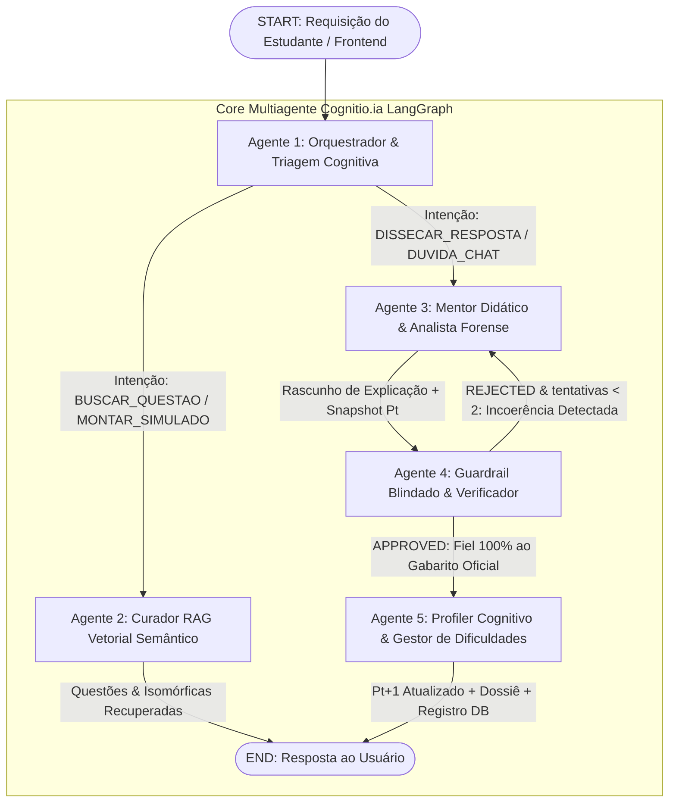

# Cognitio.ia — Agente de apoio para estudo de vestibulares e concursos

> **Piloto Oficial:** Vestibulares Seriados do Amazonas — **PSC (UFAM)** & **SIS (UEA)**  
> **Hackathon:** AKCIT Camp 2026 • 24 e 25 de Setembro de 2026  

---

## 🎯 Sobre o Projeto

A **Cognitio.ia** é uma plataforma agêntica de preparação inteligente voltada para os vestibulares seriados do Amazonas (PSC/UFAM e SIS/UEA). Apoiando-se em um acervo canônico de **5.771 questões oficiais homologadas dos últimos 20 anos**, o sistema resolve o isolamento e a desestruturação do vestibulando por meio de:

1. **Arquitetura Multiagente (LangGraph):** 5 agentes especializados (Router, Retriever RAG, Mentor Didático, Guardrail e Profiler Cognitivo) orquestrados em máquina de estados finitos.
2. **Efeito Flywheel de Dados Cross-Banca:** Sugere questões análogas entre PSC e SIS que avaliam o mesmo princípio cognitivo, ampliando o repertório e a retenção do aluno.
3. **Heatmap Cognitivo & Detecção de Pontos Cegos:** Rastreia o índice de domínio em tempo real por assunto ($P_{t+1} = g(P_t, T_t)$), orientando estudos anti-procrastinação.
4. **Mentor Didático Acolhedor com 3 Estilos:** Auxilia na resolução com explicações nos estilos *Direto*, *Socrático* e *Teórico*, preservando a memória de curto prazo da conversação.
5. **Guardrail Determinístico de Alucinação Zero:** Trava o gabarito oficial homologado como verdade absoluta (*Ground Truth Pinning*), rejeitando e autocorrigindo qualquer divergência.
6. **Simulados Oficiais Cronometrados:** Ambiente de prova fiel com diagnóstico IA pós-simulado integrado ao Dossiê Cognitivo.

---

## 🧠 Documentação do Fluxo do Agente (Inputs, Lógica e Outputs)

Em total conformidade com o **Edital AKCIT Camp 2026** (Critérios de Centralidade da IA, Profundidade de Engenharia, Avaliação/Segurança e Memória Cognitiva), o núcleo do Cognitio.ia rejeita o paradigma frágil de prompts monolíticos e opera sobre uma **máquina de estados multiagente orquestrada com LangGraph**.

### 1. Diagrama Topológico do Grafo de Execução



---

### 2. Schema do Estado Global Compartilhado (`AgentState`)

Todos os agentes compartilham e transformam um estado unificado (`AgentState`), garantindo transições idempotentes e rastreabilidade total:

```python
class AgentState(TypedDict, total=False):
    # Metadados de Sessão e Usuário
    session_id: str
    user_id: str
    perfil_id: str
    certame_foco: str                   # ex: "PSC", "SIS"
    estilo_didatico: str                # "DIRETO", "SOCRATICO", "TEORICO"

    # Contexto da Questão Ativa
    current_question_id: Optional[str]
    current_question_data: Optional[Dict[str, Any]]
    selected_alternative: Optional[str]       # "A", "B", "C", "D", "E"
    is_correct: Optional[bool]
    tempo_resolucao_segundos: Optional[int]

    # Mensagens e Triagem
    user_input_message: Optional[str]
    intent_detected: Optional[str]            # "BUSCAR_QUESTAO", "DISSECAR_RESPOSTA", "DUVIDA_CHAT", "MONTAR_SIMULADO"
    
    # Raciocínio Pedagógico e Respostas
    mentor_draft_response: Optional[str]
    verified_response: Optional[str]
    similar_questions_found: Optional[List[Dict[str, Any]]]
    error_classification: Optional[str]      # "CONCEITUAL", "OPERACIONAL", "PEGADINHA"

    # Auditoria Determinística e Guardrails
    verification_attempts: int
    guardrail_status: str                    # "PENDING", "APPROVED", "REJECTED"
    guardrail_feedback: Optional[str]

    # Memória Conversacional de Curto Prazo (Short-Term Memory)
    messages: List[Dict[str, str]]

    # Memória Temporal de Longo Prazo (Profiler Pt -> Pt+1)
    cognitive_profile_summary: Optional[Dict[str, Any]]
    identified_misconceptions: Optional[List[str]]
    didactic_guidance: Optional[str]
    subject_score_updated: Optional[float]
    critical_blindspot_detected: Optional[bool]
    profile_version: Optional[int]
```

---

### 3. Especificação Detalhada de Cada Agente (Inputs, Lógica e Outputs)

#### 3.1. Agente 1 — Orquestrador & Triagem Cognitiva (`router_agent.py`)
* **Papel:** Ponto de entrada canônico de qualquer requisição. Realiza sanitização de segurança, classifica a intenção do estudante e carrega o snapshot do perfil cognitivo ativo.
* 📥 **Inputs:**
  * `user_input_message` (str): Texto livre enviado pelo estudante (busca, dúvida ou comando).
  * `selected_alternative` (str): Letra marcada na interface ("A"–"E"), se houver.
  * `current_question_data` (dict): Metadados completos da questão em tela (enunciado, alternativas, gabarito, disciplina, assunto, banca).
  * `perfil_id` (str): Identificador do estudante logado.
  * `estilo_didatico` (str): Estilo didático ativo do aluno ("DIRETO", "SOCRATICO", "TEORICO").
* ⚙️ **Lógica:**
  1. **Sanitização de Segurança:** Checa expressões de *prompt injection* ou desvio de persona (ex.: `"ignore all previous instructions"`, `"system prompt"`). Caso detectado, anula a execução desviante (`intent_detected: "OUT_OF_SCOPE"`).
  2. **Classificação Determinística de Intenção:**
     * Se `selected_alternative` e `current_question_data` estão presentes → `intent_detected: "DISSECAR_RESPOSTA"`;
     * Se houver termos como `"simulado"`, `"montar prova"` → `intent_detected: "MONTAR_SIMULADO"`;
     * Se houver termos como `"semelhante"`, `"parecida"`, `"reforço"` → `intent_detected: "BUSCAR_SEMELHANTES"`;
     * Se houver questão ativa e texto do aluno → `intent_detected: "DUVIDA_CHAT"`;
     * Caso padrão → `intent_detected: "BUSCAR_QUESTAO"`.
  3. **Injeção do Snapshot Cognitivo ($P_t$):** Consulta o banco relacional e anexa o resumo cognitivo do aluno referente àquele tópico específico (índice de domínio, histórico recente e vícios mapeados).
* 📤 **Outputs:**
  * `intent_detected` (str): Rota decidida para a máquina de estados.
  * `cognitive_profile_summary` (dict): Snapshot de proficiência e diretriz pedagógica atual.
  * `identified_misconceptions` (list): Vícios recorrentes do aluno naquele tópico.
  * `didactic_guidance` (str): Instrução personalizada para guiar o tom do mentor.

---

#### 3.2. Agente 2 — Curador & RAG Vetorial Semântico (`retriever_agent.py`)
* **Papel:** Motor do **Flywheel de Dados Cross-Banca**. Realiza recuperação semântica densa e isola questões irmãs (*isomórficas*) entre certames rivais (PSC/UFAM vs SIS/UEA).
* 📥 **Inputs:**
  * `intent_detected` (str): `"BUSCAR_QUESTAO"` ou `"BUSCAR_SEMELHANTES"`.
  * `user_input_message` (str): Consulta em linguagem natural ou termos de busca.
  * `current_question_data` (dict): Questão base para encontrar questões espelho.
* ⚙️ **Lógica:**
  1. **Busca Vetorial Densa (FastEmbed ONNX em CPU):** Vetoriza a consulta e calcula similaridade de cosseno em relação à base canônica de 5.771 questões homologadas.
  2. **Algoritmo Flywheel Cross-Banca:** Quando o aluno erra ou estuda uma questão do PSC, o agente filtra questões de *banca oposta* (Banca Alvo = SIS se Banca Origem = PSC) com o mesmo princípio estrutural curricular (similaridade > 0.70).
  3. **Fallback Híbrido Relacional:** Caso o vetor não atinja o limiar de confiança, aplica busca relacional filtrando por `disciplina` e `assunto` da BNCC.
* 📤 **Outputs:**
  * `similar_questions_found` (list[dict]): Lista de questões com enunciado, alternativas, pontuação de similaridade e justificativa do paralelismo conceitual.
  * `verified_response` (str): Mensagem sintetizada de entrega do caderno ou questões similares.
  * `guardrail_status` (str): `"APPROVED"`.

---

#### 3.3. Agente 3 — Mentor Didático & Analista Forense (`mentor_agent.py`)
* **Papel:** Núcleo de inteligência pedagógica. Disseca o raciocínio do estudante, acolhe pontos cegos recorrentes e desfaz pegadinhas de banca sem interrogatórios agressivos.
* 📥 **Inputs:**
  * `current_question_data` (dict): Enunciado, alternativas, gabarito e comissão organizadora.
  * `selected_alternative` (str): Alternativa marcada pelo estudante.
  * `cognitive_profile_summary` (dict): Snapshot de domínio $P_t$, status do tópico e histórico de erros.
  * `estilo_didatico` (str): `"DIRETO"`, `"SOCRATICO"` ou `"TEORICO"`.
  * `messages` (list[dict]): Histórico de conversação de curto prazo (últimas mensagens trocadas na questão).
  * `intent_detected` (str): `"DISSECAR_RESPOSTA"` ou `"DUVIDA_CHAT"`.
* ⚙️ **Lógica:**
  1. **Função Epistêmica de Mentoria:** $Y_t = f(Q, \text{Alternativa}, \text{Gabarito}, P_t, \text{Estilo})$.
  2. **Detecção Proativa de Ponto Cego Crítico:** Se `status_topico == "PONTO_CEGO_CRITICO"` (aluno com ≥ 3 erros consecutivos ou domínio < 35%), o agente injeta obrigatoriamente um preâmbulo empático, acolhendo o histórico e propondo desatar o nó do conteúdo passo a passo.
  3. **Modulação por Estilo Didático:**
     * *Direto:* Explicação objetiva, foco no macete da banca examinadora e resolução imediata em passos claros (sem perguntas interrogatórias);
     * *Socrático:* Condução acolhedora do raciocínio por indução passo a passo e analogias intuitivas;
     * *Teórico:* Aula aprofundada com rigor conceitual, deduções matemáticas completas em KaTeX e análise comparativa de cada uma das 5 alternativas.
  4. **Fusão de Memória Conversacional de Curto Prazo:** Em dúvidas no chat (`DUVIDA_CHAT`), consome os turnos anteriores para responder no fluxo contínuo do diálogo sem reiniciar a explicação do zero.
  5. **Inferência LLM & Fallback Determinístico:** Invoca Gemini 2.5 Flash / Groq com temperatura baixa (0.25) e, em caso de indisponibilidade de rede, aciona um motor local determinístico pré-programado por tópicos.
* 📤 **Outputs:**
  * `mentor_draft_response` (str): Rascunho da explicação pedagógica completa.
  * `is_correct` (bool): `True` se a alternativa do aluno for igual ao gabarito oficial; `False` caso contrário.
  * `error_classification` (str): `"CONCEITUAL"`, `"OPERACIONAL"` ou `"PEGADINHA"`.
  * `verification_attempts` (int): Contador incremental de tentativas de validação.

---

#### 3.4. Agente 4 — Guardrail Blindado & Verificador Determinístico (`guardrail_agent.py`)
* **Papel:** Auditor independente de **Alucinação Zero**. Garante que a explicação do Mentor concorde 100% com o gabarito oficial homologado pela banca examinadora.
* 📥 **Inputs:**
  * `mentor_draft_response` (str): O rascunho de texto gerado pelo Mentor Didático.
  * `current_question_data` (dict): Contém a verdade fundamental canônica (`gabarito_oficial`).
  * `verification_attempts` (int): Contador de ciclos de auditoria.
* ⚙️ **Lógica:**
  1. **Ground Truth Pinning (Auditoria Determinística):** Varre o texto gerado via expressões regulares estritas em busca de afirmações que contradigam a comissão examinadora (ex.: afirmar que a resposta correta é "E" quando o gabarito oficial é "A").
  2. **Loop de Retificação Condicional:**
     * Se houver contradição e `attempts < 2`: Define `guardrail_status: "REJECTED"`, anexa feedback corretivo explícito (`guardrail_feedback`) e roteia de volta ao Agente Mentor para reescrita imediata.
     * Se a inconsistência persistir após 2 tentativas: Aciona o *fail-safe determinístico*, substituindo a explicação por uma síntese canônica oficial inviolável.
  3. **Aprovação:** Se o texto estiver 100% alinhado com a banca, define `guardrail_status: "APPROVED"`.
* 📤 **Outputs:**
  * `guardrail_status` (str): `"APPROVED"` ou `"REJECTED"`.
  * `verified_response` (str): Texto da resposta auditado e liberado para o aluno.
  * `guardrail_feedback` (str): Motivo de aprovação ou diretriz de retificação obrigatória.

---

#### 3.5. Agente 5 — Profiler Cognitivo & Gestor de Dificuldades (`profiler_agent.py`)
* **Papel:** Guardião da **Memória Evolutiva de Longo Prazo**. Atualiza a matriz de proficiência epistêmica do estudante ($P_{t+1} = g(P_t, T_t)$) e gera o Dossiê Cognitivo vivo.
* 📥 **Inputs:**
  * `perfil_id` (str): Identificador do perfil do estudante.
  * `current_question_data` (dict): Tópico curricular, disciplina e complexidade da questão.
  * `selected_alternative` (str): Alternativa marcada.
  * `is_correct` (bool): Indicador binário de acerto/erro.
  * `tempo_resolucao_segundos` (int): Tempo de resposta do aluno.
  * `error_classification` (str): Tipo de erro diagnosticado.
* ⚙️ **Lógica:**
  1. **Persistência da Tentativa:** Grava o log atômico em `TentativaQuestao` para auditoria histórica.
  2. **Knowledge Tracing Ponderado por EWMA:** Recalcula a proficiência do tópico através de Média Móvel Ponderada Exponencial com taxa de aprendizado adaptativa ($\alpha = 0.35$):
     $$\mathrm{Score}_{t+1} = (1 - \alpha) \cdot \mathrm{Score}_t + \alpha \cdot \mathrm{Impacto}_t \quad (\text{onde } \mathrm{Impacto}_t \in \{0, 100\})$$
  3. **Detecção de Ponto Cego Crítico:** Classifica automaticamente o estado do tópico:
     * `PONTO_CEGO_CRITICO`: se `erros_consecutivos >= 3` ou (`total_tentativas >= 3` e `score < 35.0`);
     * `ATENCAO_NECESSARIA`: se score entre 35% e 60%;
     * `DOMINIO_CONSOLIDADO`: se score ≥ 75%.
  4. **Atualização do Dossiê Cognitivo Vivo:** Compila e persiste o Dossiê Cognitivo em Markdown e JSON estruturado, incrementando a versão do perfil (`versao_perfil = versao + 1`).
* 📤 **Outputs:**
  * `subject_score_updated` (float): Novo score percentual de domínio no assunto.
  * `critical_blindspot_detected` (bool): `True` se o tópico se tornou ponto cego.
  * `profile_version` (int): Nova versão sequencial do perfil cognitivo.
  * `cognitive_profile_summary` (dict): Snapshot atualizado para as próximas requisições.

---

### 4. Matriz Resumo de Fluxo (Inputs → Lógica → Outputs)

| Nó / Agente | Inputs Principais | Lógica Central de Execução | Outputs Principais |
| :--- | :--- | :--- | :--- |
| **1. Router** | Mensagem do aluno, alternativa marcada, dados da questão, perfil ID. | Sanitização contra injection; detecção de intenção; injeção do snapshot $P_t$. | `intent_detected`, `cognitive_profile_summary`, `didactic_guidance`. |
| **2. Retriever** | Intenção de busca, texto/conceito, questão de referência. | Busca vetorial FastEmbed ONNX; filtro cruzado de bancas (PSC ↔ SIS); fallback relacional. | `similar_questions_found`, `verified_response`, `guardrail_status: APPROVED`. |
| **3. Mentor** | Questão ativa, alternativa marcada, gabarito oficial, estilo didático, snapshot $P_t$, mensagens prévias. | Raciocínio pedagógico $Y_t = f(Q, A, G, P_t)$; acolhimento de pontos cegos críticos; memória conversacional de curto prazo; LLM + fallback local. | `mentor_draft_response`, `is_correct`, `error_classification`, `verification_attempts`. |
| **4. Guardrail** | Rascunho da explicação do mentor, gabarito oficial canônico, contador de tentativas. | *Ground Truth Pinning*; auditoria determinística regex contra contradição do gabarito oficial; loop de reescrita se inconsistente. | `guardrail_status: APPROVED \| REJECTED`, `verified_response`, `guardrail_feedback`. |
| **5. Profiler** | Perfil ID, questão respondida, acerto/erro, tempo gasto, tipo do erro. | Knowledge Tracing EWMA ($P_{t+1} = g(P_t, T_t)$); detecção de pontos cegos; persistência em banco; geração do Dossiê Cognitivo. | `subject_score_updated`, `critical_blindspot_detected`, `profile_version`, `dossie_cognitivo_markdown`. |

---

### 5. Exemplo de Ciclo Completo (Caso Real do Pitch: PSC 2024 Questão 44)

1. **Ação do Estudante:** O aluno Lucas resolve a questão `PSC_2024_E1_FISICA_44` (Termologia e Calorimetria: resfriamento por ar vs água). Ele já acumulava 3 erros prévios nesse tópico e marca o distrator **Letra E** (0,25).
2. **Triagem no Router:** O Router sanitiza o payload, reconhece a ação de submissão de resposta (`DISSECAR_RESPOSTA`) e anexa o snapshot com `status_topico: "PONTO_CEGO_CRITICO"` e `score: 0.0`.
3. **Intervenção do Mentor:** O Mentor detecta a bandeira de ponto cego e inicia a resposta acolhendo as 3 dificuldades anteriores em Calorimetria. Em seguida, desmonta a confusão da razão inversa ($m_1 \cdot 0,25 = m_2 \cdot 1,0 \implies m_1/m_2 = 4$) sem fazer perguntas interrogatórias.
4. **Auditoria no Guardrail:** O Guardrail verifica que a explicação reforça que a resposta correta da banca é a **Letra A** (4,0). O texto é chancelado como `APPROVED`.
5. **Atualização no Profiler:** O Profiler registra a tentativa, atualiza o histórico para 4 erros, mantém o alerta de ponto cego e incrementa o Dossiê Cognitivo.
6. **Dissecação Contínua no Chat:** O estudante pergunta no chat: *"Tutor, por que na prática eu preciso de 4 vezes mais ar do que de água para resfriar a mesma quantidade?"*. O Router roteia para `DUVIDA_CHAT`, o Mentor resgata o histórico recente e responde usando a analogia intuitiva da *esponja térmica*, mantendo coerência absoluta.

---

### 6. Observabilidade e Telemetria em Tempo Real (`AgentTracer`)

Cada nó do grafo LangGraph é envelopado por um interceptador de observabilidade (`_make_traced_node`) que transmite eventos em tempo real via WebSocket:

* `emit_node_start`: Notifica início do nó, ferramentas ativas e snapshot do estado de entrada.
* `emit_node_end`: Registra tempo exato de execução em milissegundos (ms), status (`done` / `rejected`) e variáveis de saída.
* `emit_guardrail_event`: Emite evento crítico de auditoria com status de conformidade do gabarito oficial.
* `emit_edge`: Mapeia a transição visual entre nós no visualizador do grafo.

---

## 🏗️ Arquitetura Técnica

- **Backend:** FastAPI, Python 3.11+, SQLAlchemy, LangGraph, Pydantic v2, SQLite / PostgreSQL + pgvector, FastEmbed (ONNX).
- **Frontend:** Next.js 14 (App Router), TypeScript, Tailwind CSS, KaTeX (renderização de notação científica e fórmulas matemáticas).
- **Dados:** 5.771 questões históricas certificadas com gabaritos oficiais homologados e taxonomia curricular alinhada à BNCC.

---

## 🚀 Como Executar

### 1. Instalação das Dependências

#### Backend (Python 3.11+)
```bash
cd lg2m/backend
python3 -m venv .venv
source .venv/bin/activate
pip install -r requirements.txt
cp .env.example .env
# Configure sua GEMINI_API_KEY no arquivo .env
```

#### Frontend (Node.js 18+)
```bash
cd lg2m/frontend
npm install
```

### 2. Inicialização dos Serviços

#### Iniciar o Backend
```bash
cd lg2m/backend
uvicorn app.main:app --host 0.0.0.0 --port 8000 --reload
```
Acesse a documentação interativa em: [`http://localhost:8000/docs`](http://localhost:8000/docs)

#### Iniciar o Frontend
```bash
cd lg2m/frontend
npm run dev
```
Acesse a aplicação web em: [`http://localhost:3000`](http://localhost:3000)

---

## 📚 Documentação Completa

Toda a engenharia de dados, decisões arquiteturais (ADRs), contratos de API e relatórios experimentais estão documentados no diretório [`docs/`](docs/):

- [`docs/plano_execucao_mvp.md`](docs/plano_execucao_mvp.md): Plano de execução mestre do MVP em 7 fases.
- [`docs/api_contracts.md`](docs/api_contracts.md): Especificação completa dos contratos de API REST e SSE.
- [`docs/proposta_melhoria_busca_vetorial.md`](docs/proposta_melhoria_busca_vetorial.md): Arquitetura de evolução da busca vetorial (Two-Stage Retrieval, RRF, Cross-Encoder, HyDE).
- [`docs/arquitetura_multiagente.md`](docs/arquitetura_multiagente.md): Grafo de estados e nós do LangGraph.
- [`docs/data_pipeline.md`](docs/data_pipeline.md): Engenharia de dados e schema canônico.
- [`docs/reports/experimento_flywheel.md`](docs/reports/experimento_flywheel.md): Validação científica do Efeito Flywheel Cross-Banca.
- [`docs/reports/auditoria_dataset_mvp.md`](docs/reports/auditoria_dataset_mvp.md): Certificação formal do dataset de 6.158 questões canônicas.
- [`docs/roteiro_demo_pitch.md`](docs/roteiro_demo_pitch.md): Roteiro cronometrado para apresentação do pitch.
