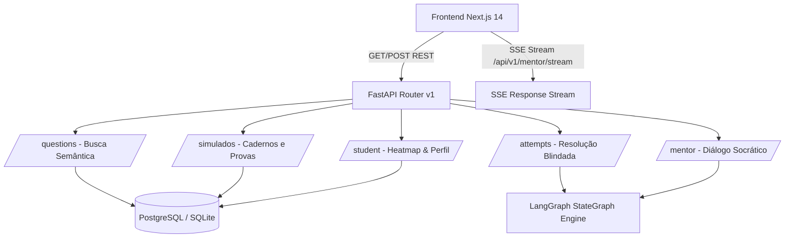

# Contratos de API REST e Streaming SSE — Ecossistema LG2M

**Projeto:** LG2M — Ecossistema Agêntico de Estudos Seriado (PSC/UFAM & SIS/UEA)  
**Hackathon:** AKCIT Camp 2026  
**Status:** 100% Implementado e Homologado  
**Host Local Padrão:** `http://localhost:8000`  
**Documentação Interativa:** `http://localhost:8000/docs` (Swagger UI) e `/redoc` (ReDoc)  

---

## 1. Visão Geral da Arquitetura de Comunicação

O backend do LG2M expõe uma interface de alta performance com endpoints RESTful síncronos e endpoints reativos com Server-Sent Events (SSE) para transmissão de raciocínio didático em tempo real.



### Regras Universais de Segurança e Integridade Pedagógica
1. **Blindagem Estrita de Gabarito:** Nenhuma rota de busca de questões (`/questions/search` ou `/questions/{id}`) ou de carregamento de caderno de simulado (`/simulados/{id}`) expõe o gabarito oficial ou a indicação de qual alternativa é a correta.
2. **Homologação Atômica:** O gabarito só é revelado após a submissão formal da tentativa (`POST /attempts/{id}` ou `POST /simulados/{id}/submit`), disparando imediatamente a atualização do perfil cognitivo e o motor multiagente.
3. **CORS Permissivo para Desenvolvimento:** Aceita requisições do frontend local Next.js (`http://localhost:3000`).

---

## 2. Endpoints do Módulo Questões (`/api/v1/questions`)

### 2.1. Busca Semântica e Filtros Curriculares
Permite pesquisar o acervo de 6.158 questões canônicas certificadas por texto livre, certame, etapa, disciplina ou ano.

- **Métodos:** `GET /api/v1/questions/search` | `POST /api/v1/questions/search`
- **Query Params (GET) ou JSON Body (POST):**
```json
{
  "query": "Leis de Newton plano inclinado com atrito",
  "certame": "PSC",
  "etapa": "1",
  "disciplina": "Física",
  "ano": 2024,
  "limit": 10
}
```
- **Resposta Sucesso (`200 OK`):**
```json
[
  {
    "id": "PSC_2024_E1_FISICA_45",
    "codigo_referencia": "PSC 2024 - 1ª Etapa - Questão 45",
    "certame": "PSC",
    "ano": 2024,
    "etapa": "1",
    "numero_questao": 45,
    "disciplina": "Física",
    "area_conhecimento": "Ciências da Natureza",
    "assunto": "Dinâmica e Leis de Newton",
    "texto_base": "Um bloco de massa m escorrega sobre uma rampa inclinada...",
    "enunciado": "Considerando o coeficiente de atrito cinético igual a 0,2...",
    "alternativas": {
      "A": "a aceleração resultante vale 4,2 m/s².",
      "B": "a aceleração resultante vale 5,8 m/s².",
      "C": "o bloco permanece em repouso absoluto.",
      "D": "a força normal sobre o bloco é nula.",
      "E": "a aceleração independe da gravidade local."
    },
    "tem_imagem": false,
    "imagens": [],
    "possui_formula_matematica": true,
    "descricao_detalhada": "Problema de plano inclinado com atrito cinético onde solicita-se calcular a aceleração resultante...",
    "curadoria": "AGENTE_ANTIGRAVITY",
    "tags": ["PSC", "Etapa 1", "Física"]
  }
]
```

### 2.2. Detalhes de uma Questão
- **Método:** `GET /api/v1/questions/{question_id}`
- **Parâmetro de Rota:** `question_id` (ex: `PSC_2024_E1_FISICA_45`).
- **Resposta Sucesso (`200 OK`):** Retorna o objeto `QuestionDetailResponse` individual com gabarito omitido.

### 2.3. Flywheel de Questões Semelhantes (Cross-Banca RAG)
- **Método:** `GET /api/v1/questions/{question_id}/similar`
- **Comportamento:** Aciona o Agente Retriever do LangGraph. Localiza questões de vestibulares seriados irmãos (ex: se a questão base é do PSC/UFAM, busca itens com o mesmo princípio de raciocínio no SIS/UEA).
- **Resposta Sucesso (`200 OK`):**
```json
[
  {
    "id": "SIS_2023_E1_FISICA_42",
    "codigo_referencia": "SIS 2023 - 1ª Etapa - Questão 42",
    "certame": "SIS",
    "disciplina": "Física",
    "assunto": "Dinâmica e Leis de Newton",
    "enunciado": "Um bloco de 2 kg apoiado em plano com atrito...",
    "razao_similaridade": "Mesmo conceito de força de atrito dinâmico e equilíbrio em plano inclinado."
  }
]
```

---

## 3. Endpoints do Módulo Resolução & Tentativas (`/api/v1/attempts`)

### 3.1. Submissão de Tentativa de Resolução
- **Método:** `POST /api/v1/attempts/{question_id}`
- **Payload (`QuestionAttemptRequest`):**
```json
{
  "alternativa_marcada": "B",
  "tempo_gasto_segundos": 65,
  "estilo_didatico": "SOCRATICO",
  "perfil_id": "uuid-opcional"
}
```
- **Resposta Sucesso (`200 OK`):**
```json
{
  "acertou": false,
  "gabarito_oficial": "A",
  "alternativa_marcada": "B",
  "explicacao_mentor": "Observe que ao decompor a força peso na direção paralela ao plano inclinado...",
  "estilo_didatico": "SOCRATICO",
  "causa_erro": "CONCEITUAL",
  "novo_score_assunto": 45.0,
  "ponto_cego_detectado": true
}
```

---

## 4. Endpoints do Mentor Didático Multiagente (`/api/v1/mentor`)

### 4.1. Diálogo Socrático Interativo
- **Método:** `POST /api/v1/mentor/chat`
- **Payload (`MentorChatRequest`):**
```json
{
  "questao_id": "PSC_2024_E1_FISICA_45",
  "mensagem": "Por que a alternativa D está incorreta se o bloco está descendo?",
  "estilo_didatico": "SOCRATICO",
  "perfil_id": "uuid-opcional"
}
```
- **Resposta Sucesso (`200 OK`):**
```json
{
  "questao_id": "PSC_2024_E1_FISICA_45",
  "resposta": "Pense no contato entre a base do bloco e a superfície do plano inclinado. A força normal só se anularia se houvesse decolagem ou ausência de contato físico!",
  "estilo_utilizado": "SOCRATICO",
  "estilo_didatico": "SOCRATICO",
  "guardrail_status": "APPROVED"
}
```

### 4.2. Streaming Server-Sent Events (SSE)
- **Método:** `GET /api/v1/mentor/stream`
- **Query Params:** `questao_id`, `mensagem`, `estilo` (`DIRETO`, `SOCRATICO`, `TEORICO`).
- **Tipo de Mídia de Retorno:** `text/event-stream`.
- **Formato dos Pacotes:**
```text
data: {"token": "Pense "}

data: {"token": "no "}

data: {"token": "contato..."}

data: [DONE]
```

---

## 5. Endpoints de Simulados (`/api/v1/simulados`)

### 5.1. Geração de Simulado Oficial ou Temático
- **Métodos:** `POST /api/v1/simulados` | `POST /api/v1/simulados/create`
- **Payload (`SimuladoCreateRequest`):**
```json
{
  "certame_sigla": "PSC",
  "etapa": "1",
  "tipo": "GERAL",
  "quantidade_questoes": 15
}
```
- **Resposta Sucesso (`200 OK`):**
```json
{
  "simulado_id": "708d9b16-c1df-4166-a3d1-c49217c49ba3",
  "certame": "PSC",
  "etapa": "1",
  "tipo": "GERAL",
  "total_questoes": 15,
  "tempo_limite_minutos": 180,
  "status": "EM_ANDAMENTO",
  "questoes": [
    {
      "ordem": 1,
      "questao_id": "PSC_2023_E1_LP_01",
      "disciplina": "Língua Portuguesa",
      "assunto": "Compreensão e Interpretação de Texto",
      "enunciado": "Leia a crônica para responder...",
      "alternativas": { "A": "...", "B": "...", "C": "...", "D": "...", "E": "..." }
    }
  ]
}
```

### 5.2. Submissão de Simulado e Emissão de Diagnóstico Cognitivo
- **Método:** `POST /api/v1/simulados/{simulado_id}/submit`
- **Payload (`SimuladoSubmitRequest`):**
```json
{
  "respostas": {
    "PSC_2023_E1_LP_01": "B",
    "PSC_2023_E1_LP_02": "A"
  },
  "tempo_utilizado_segundos": 4200
}
```
- **Resposta Sucesso (`200 OK`):**
```json
{
  "simulado_id": "708d9b16-c1df-4166-a3d1-c49217c49ba3",
  "total_questoes": 15,
  "total_acertos": 12,
  "acertos": 12,
  "aproveitamento_percentual": 80.0,
  "tempo_gasto_segundos": 4200,
  "desempenho_por_disciplina": {
    "Língua Portuguesa": { "total": 5, "acertos": 5 },
    "Física": { "total": 5, "acertos": 3 },
    "Química": { "total": 5, "acertos": 4 }
  },
  "diagnostico_ia": "Excelente desempenho! Você atingiu 80.0% de aproveitamento geral, compatível com os primeiros colocados de cursos concorridos.",
  "itens": [
    {
      "ordem": 1,
      "questao_id": "PSC_2023_E1_LP_01",
      "disciplina": "Língua Portuguesa",
      "alternativa_marcada": "B",
      "gabarito_oficial": "B",
      "acertou": true,
      "dissecar_link": "/api/v1/attempts/PSC_2023_E1_LP_01"
    }
  ]
}
```

---

## 6. Endpoints do Perfil e Heatmap (`/api/v1/student`)

### 6.1. Perfil do Estudante
- **Método:** `GET /api/v1/student/profile`
- **Resposta Sucesso (`200 OK`):**
```json
{
  "usuario_id": "...",
  "perfil_id": "...",
  "nome": "Lucas Eduardo",
  "email": "estudante.demo@lg2m.edu.br",
  "certame_foco": "PSC",
  "estilo_didatico_padrao": "DIRETO",
  "total_tentativas": 35,
  "total_acertos": 27,
  "taxa_acerto_geral": 77.1,
  "pontos_cegos_count": 2,
  "tempo_medio_segundos": 54.3
}
```

### 6.2. Heatmap de Domínio e Pontos Cegos
- **Método:** `GET /api/v1/student/heatmap`
- **Resposta Sucesso (`200 OK`):**
```json
{
  "perfil_id": "...",
  "total_assuntos_avaliados": 14,
  "pontos_cegos_count": 2,
  "pontos_cegos": [
    {
      "assunto": "Dinâmica e Leis de Newton",
      "disciplina": "Física",
      "area": "Ciências da Natureza",
      "total_tentativas": 4,
      "total_erros": 3,
      "indice_dominio": 25.0,
      "eh_ponto_cego": true
    }
  ],
  "heatmap": [ ... ]
}
```

### 6.3. Recomendações Anti-Procrastinação
- **Método:** `GET /api/v1/student/recommendations?limit=5`
- **Resposta Sucesso (`200 OK`):** Retorna uma lista curada de questões pertencentes aos tópicos onde o aluno apresenta os pontos cegos mais críticos.
