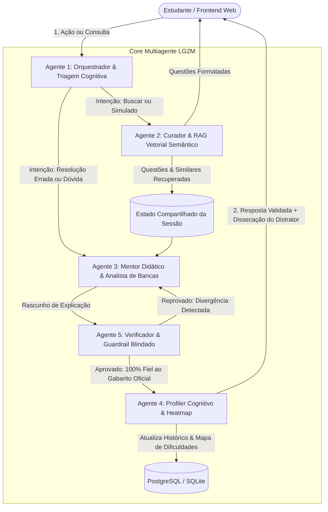

# Arquitetura do Sistema Multiagente — LG2M

> **Módulo:** Inteligência Artificial & Grafo Multiagente  
> **Status:** Especificação e Implementação Oficial  
> **Versão:** 1.0  
> **Data:** 24/09/2026  
> **Framework:** LangGraph / LangChain  
> **Implementação:** `lg2m/backend/app/agents/`

---

## 1. Visão Geral da Topologia Multiagente

Em perfeita conformidade com os parâmetros do **Edital do AKCIT Camp 2026** (Centralidade da IA e Profundidade de Engenharia), o motor cognitivo da LG2M rejeita o paradigma frágil de prompts monolíticos e adota uma **máquina de estados multiagente com agentes autônomos especializados**:

---

## 2. Especificação dos 5 Agentes Especializados

### 2.1. Agente 1: Orquestrador & Triagem Cognitiva (`router_agent.py`)
- **Papel:** Ponto de entrada de todas as interações. Sanitiza prompts contra ataques de injeção, avalia o contexto ativo da questão e classifica a intenção do estudante.
- **Roteamentos Possíveis:**
  - `BUSCAR_QUESTAO`: Direciona para o Curador Semântico;
  - `DISSECAR_RESPOSTA`: Aciona o Mentor Didático imediatamente após confirmação de tentativa errada;
  - `DUVIDA_CHAT`: Mantém o diálogo no contexto da questão atual;
  - `MONTAR_SIMULADO`: Gera caderno balanceado.

### 2.2. Agente 2: Curador & RAG Vetorial Semântico (`retriever_agent.py`)
- **Papel:** O motor do **Flywheel de Dados Semânticos**. Realiza busca híbrida por similaridade vetorial combinada com filtros relacionais SQL (Banca, Ano, Disciplina, Etapa).
- **Função Flywheel:** Identifica **questões irmãs (isomórficas)** entre bancas distintas (ex: confrontando abordagens análogas entre UFAM/COMPEC e UEA/Vunesp) com similaridade de cosseno $> 0.82$.

### 2.3. Agente 3: Mentor Didático & Analista Forense de Bancas (`mentor_agent.py`)
- **Papel:** O núcleo de inteligência pedagógica. Disseca o distrator específico marcado pelo candidato e desmascara o padrão de pegadinhas da banca examinadora nos 3 estilos didáticos:
  1. **Direto & Prático:** Foco no macete e anulação rápida do erro em menos de 150 palavras;
  2. **Socrático & Reflexivo:** Não revela a resposta de imediato; conduz o raciocínio por meio de perguntas indutivas;
  3. **Teórico & Detalhado:** Passo a passo aprofundado, cobrindo teoremas, notação científica KaTeX e análise comparativa de todas as alternativas (A a E).

### 2.4. Agente 5: Verificador, Solver & Guardrail Blindado (`guardrail_agent.py`)
- **Papel:** Garantir **Alucinação Zero**. Auditor independente determinístico que atua entre o Mentor e o Estudante:
  - *Ground Truth Pinning:* O gabarito oficial homologado pela banca é injetado como verdade canônica inegociável;
  - *Auditoria Textual:* Se o rascunho do mentor insinuar ou declarar que outra letra é a correta em desacordo com a banca, a mensagem é imediatamente rejeitada e devolvida com diretriz de retificação;
  - *Math Sandbox:* Verificação simbólica em Python para cálculos exatos.

### 2.5. Agente 4: Profiler Cognitivo & Gestor de Dificuldades (`profiler_agent.py`)
- **Papel:** Guardião da memória de longo prazo da jornada de aprendizado.
  - Atualiza o registro na tabela `RegistroDificuldade`;
  - Recalcula a média móvel ponderada exponencial de domínio:
    $$\mathrm{Score}_{\mathrm{assunto}} = \frac{\sum_{i=1}^{n} (\mathrm{Acerto}_i \times i)}{\sum_{i=1}^{n} i}$$
  - Detecta se o estudante atingiu a condição de **Ponto Cego Crítico** (< 50% de acerto nas tentativas recentes) e sugere proativamente blocos de questões semelhantes de reforço.
