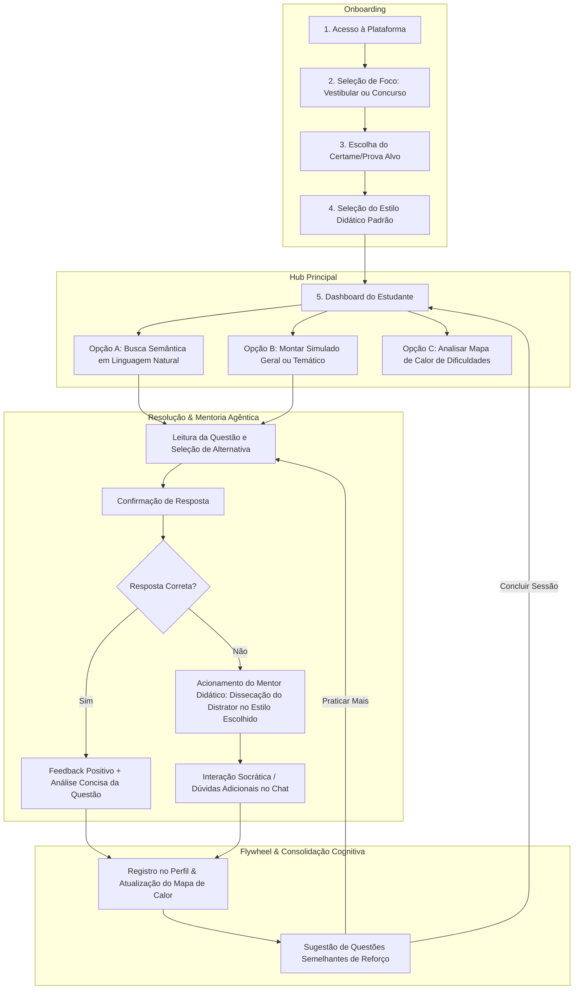
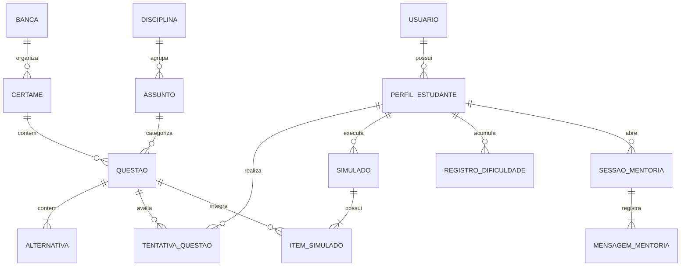
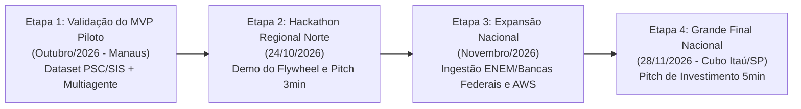
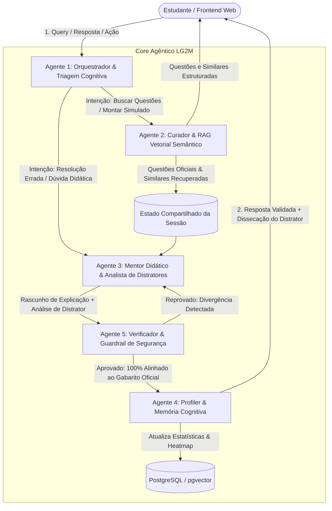

# Documento de Especificação de Produto — LG2M

# Ecossistema Agêntico de Estudo Ativo e Mentoria por Questões para Vestibulares e Concursos Públicos

> **Status:** Especificação Completa Reformulada — Hackathon AKCIT Camp 2026  
> **Versão:** 2.0 (Arquitetura Universal, Flywheel de Dados Semânticos & Sistema Multiagente)  
> **Data de Atualização:** 24/09/2026  
> **Autores / Equipe:** Equipe LG2M

---

## 1. Visão Geral

### Nome do projeto/produto:

**LG2M — Mentor Agêntico de Estudos** _(Ecossistema Universal de Aprendizagem Ativa e Recuperação Semântica de Questões com Agentes Autônomos de IA)_.

### Resumo em uma frase (Elevator Pitch):

Plataforma agêntica de estudo ativo que atua como mentor especialista para vestibulares e concursos públicos do Brasil inteiro, dissecando gabaritos e distratores de bancas examinadoras e potencializando a recuperação de questões semelhantes por busca semântica à medida que o acervo de questões cresce.

### Qual problema real esse produto resolve?

Milhões de brasileiros que se preparam anualmente para vestibulares (ENEM, Fuvest, Unicamp, exames seriados) e concursos públicos (carreiras fiscais, administrativas, policiais, bancárias e jurídicas) enfrentam três gargalos pedagógicos estruturais:

1. **Gabaritos Oficiais Secos, Estáticos e Binários:** As bancas examinadoras (Cebraspe, FGV, FCC, Fundação Vunesp, Cesgranrio, bancas universitárias, etc.) publicam gabaritos que apenas informam a letra correta (ex: _"Item 34: Letra D"_). Não explicam a linha de raciocínio da questão e omitem a pedagogia dos _distratores_ (as alternativas incorretas propositadamente desenhadas para induzir ao erro). O estudante erra, mas continua sem entender a armadilha conceitual na qual caiu.
2. **Inflexibilidade e Busca Limitada nos Bancos de Questões Tradicionais:** As plataformas vigentes dependem de correspondência exata de palavras-chave (filtros léxicos). Se o aluno procura por um conceito que foi enunciado com termos ligeiramente diferentes, o sistema falha em encontrá-lo. Além disso, comentários de fóruns de usuários são frequentemente prolixos, incorretos, desatualizados ou inexistentes para provas recentes.
3. **Solidão e Rigidez Pedagógica:** O estudo por questões é hoje um ato solitário. Falta um mentor inteligente capaz de diagnosticar _por que_ o aluno errou (se foi erro conceitual, falha operacional de cálculo ou falta de atenção a pegadinhas) e de modular sua explicação de acordo com o perfil didático do estudante (ora direto e prático, ora socrático e indutivo, ora teórico e detalhado).

### A Tese Central: O Efeito Flywheel de Dados Semânticos

Um dos maiores diferenciais da LG2M é o **efeito de rede do conhecimento por similaridade vetorial**:

- As bancas examinadoras de todo o país frequentemente cobram os mesmos princípios fundamentais através de **estruturas isomórficas** (questões irmãs ou conceitos análogos aplicados a contextos distintos).
- **Quanto mais questões oficiais de diferentes bancas, vestibulares e concursos forem indexadas no espaço vetorial do sistema, mais rica e precisa se torna a busca semântica.**
- Ao pesquisar um tema em linguagem natural ou errar uma questão de uma banca específica, o sistema é capaz de localizar instantaneamente questões conceituais semelhantes de outros certames nacionais, permitindo que o candidato enxergue o padrão de cobrança transversal e elimine pontos cegos com máxima eficácia.

### Contexto de MVP no Hackathon AKCIT Camp: A Escolha do Conjunto Piloto

O objetivo final da LG2M é ser a plataforma universal de mentoria por questões para qualquer prova do Brasil. No entanto, para o escopo estrito do Hackathon AKCIT Camp 2026 (Polo Regional Norte / Manaus) e em respeito ao curto prazo de desenvolvimento e validação competitiva, foi adotada a estratégia de **Vertical Slice / Piloto de Validação**:

- Foram selecionados como conjunto inicial de dados consolidados os vestibulares seriados do Estado do Amazonas: o **PSC (UFAM/COMPEC)** e o **SIS (UEA/Vunesp)**, em suas etapas 1, 2 e 3.
- **Por que esse recorte no MVP?**
  1. _Curto Tempo de Hackathon:_ Permite testar o fluxo agêntico ponta a ponta com um conjunto estruturado, homogêneo e de alta qualidade curricular;
  2. _Domínio Público Estrito:_ Provas e gabaritos históricos da UFAM e UEA são documentos públicos abertos (Art. 8º da Lei nº 9.610/98), livres de entraves autorais;
  3. _Diversidade de Conteúdos:_ O PSC e SIS cobrem todas as disciplinas do Ensino Médio (Exatas, Humanas, Biológicas e Regionais), funcionando como laboratório ideal para provar que a busca semântica, a dissecação de distratores e o mapa de dificuldades funcionam antes de escalar para milhares de outras provas nacionais.

A arquitetura, o banco de dados, os agentes e o modelo de negócios foram concebidos desde o primeiro dia de forma **100% agnóstica a certames**, prontos para receber dezenas de milhares de questões do ENEM, Cebraspe, FGV, FCC, OAB e concursos federais.

### Por que agora? O que motivou a ideia?

- **Maturidade de Agentes Autônomos e Function Calling:** Modelos de linguagem modernos (como Claude 3.5 Sonnet e GPT-4o) combinados com frameworks orquestradores (LangGraph) possibilitam separar tarefas em agentes especializados (recuperação, mentoria, auditoria e memória cognitiva).
- **Embeddings Densos e Busca Híbrida em Escala:** A evolução dos bancos vetoriais (`pgvector`, Qdrant) permite indexar centenas de milhares de questões e executar similaridade de cosseno em milissegundos, viabilizando o efeito flywheel de questões semelhantes.
- **Demanda Reprimida no Mercado Preparatório:** O mercado de concursos e vestibulares movimenta bilhões de reais no Brasil, mas os estudantes continuam carentes de ferramentas que transformem o erro em aprendizado ativo imediato.

---

## 2. Objetivos

### Objetivo principal do produto:

Construir e validar uma plataforma nacional inteligente de mentoria agêntica para resolução de questões de vestibulares e concursos, provando no MVP do hackathon — através de um dataset piloto consolidado (PSC/SIS) — que a busca semântica vetorial, a dissecação automatizada de distratores de banca e o mapeamento de dificuldades proporcionam um salto de produtividade e retenção cognitiva para o estudante.

### Como saberemos que deu certo? (Métricas de Sucesso - SMART):

1. **Precisão da Recuperação Semântica (RAG):** Mais de **90% das buscas em linguagem natural** retornando questões contextualmente relevantes e pedagogicamente análogas entre as 3 primeiras posições (Top-3 Relevance).
2. **Eficiência do Flywheel de Dados:** Comprovar experimentalmente que a adição de novas provas à base vetorial aumenta em mais de **35% a densidade de questões similares** recuperadas para um mesmo tópico conceitual.
3. **Validação Didática dos Distratores:** Índice de aprovação superior a **85%** no feedback do usuário (_"Esta explicação esclareceu por que o distrator está incorreto?"_).
4. **Alucinação Zero e Fidelidade ao Gabarito Oficial:** **0% de divergência** entre a resposta do mentor e o gabarito oficial homologado pela banca examinadora, garantido por guardrail determinístico.
5. **Engajamento e Retenção no MVP:** Média superior a **15 questões resolvidas por sessão ativa** e taxa de conclusão de simulados superior a **70%**.
6. **Desempenho de IA em Tempo Real:** Início do streaming da resposta do mentor (TTFT) inferior a **2,5 segundos**, viabilizando um diálogo fluido.

### Existe prazo ou marco importante?

- **21/09/2026:** Validação da Inscrição no AKCIT Camp (Polo Norte / Manaus).
- **04/10/2026 e 18/10/2026:** Entrega do 1º e 2º Relatórios Quinzenais de Progresso (Jornada Gamificada).
- **24/10/2026:** Realização do Hackathon Regional Norte (Manaus) — Demonstração ao vivo do protótipo com dataset piloto, pitch de 3 minutos e submissão dos entregáveis técnicos obrigatórios até o horário de congelamento (15h30).
- **01/11/2026 e 15/11/2026:** 3º e 4º Relatórios Quinzenais e mentorias de negócio e tecnologia com especialistas da AWS e do AKCIT.
- **28/11/2026:** Hackathon Final Nacional em São Paulo (Cubo Itaú) — Pitch de 5 minutos para banca de investidores, demonstrando tração, unit economics, defensibilidade do flywheel de dados e plano de expansão nacional para ENEM e grandes concursos.

---

## 3. Público-alvo e Personas

### O Mercado Endereçável Universal:

O produto atende a dois grandes grupos complementares em todo o território nacional:

- **Vestibulandos:** Candidatos do ENEM, de vestibulares tradicionais (FUVEST, UNICAMP, UERJ) e de exames seriados (PSC/UFAM, SIS/UEA, PAS/UnB, SSA/UPE).
- **Concurseiros:** Candidatos a concursos públicos municipais, estaduais e federais (Receita Federal, INSS, Tribunais de Justiça, Polícias Civil e Federal, Bancos Públicos e Carreiras Fiscais).

---

### Persona 1 (MVP — O Estudante / Concurseiro Focado em Prática Ativa)

- **Nome fictício:** Lucas Eduardo ("O Praticante por Questões").
- **Idade / perfil demográfico:** 19 a 24 anos, estudante universitário ou recém-formado no Ensino Médio, classe média, residente em área urbana.
- **Contexto (trabalho, rotina, tecnologia que usa):** Estuda de 4 a 6 horas líquidas diárias. Utiliza notebook e celular. Já assistiu a aulas teóricas e sabe que a chave para a aprovação é a **resolução massiva de questões anteriores da banca examinadora**. No MVP, utiliza o dataset consolidado do PSC/SIS para treinar, mas planeja prestar outros vestibulares e concursos.
- **Principal dor / frustração:** Ao errar uma questão, perde muito tempo procurando resoluções confiáveis na internet. Fica revoltado quando o gabarito oficial diz apenas que a resposta é a letra C, sem explicar por que a alternativa B (que parecia correta) é uma armadilha. Não consegue encontrar com facilidade outras questões de bancas diferentes que cobrem a mesma malícia conceitual.
- **O que essa pessoa quer alcançar usando o produto:** Ganhar velocidade de estudo, dissecar a lógica das pegadinhas da banca, encontrar questões semelhantes para treinar o mesmo conceito e ter um mentor disponível 24/7 que explique o erro no estilo que ele preferir (direto, socrático ou aprofundado).
- **Nível técnico:** Intermediário / Nativo digital.

---

### Persona 2 (Pós-MVP / Expansão Nacional — O Concurseiro em Construção de Base)

- **Nome fictício:** Mariana Rocha ("A Concurseira em Transição de Carreira").
- **Idade / perfil demográfico:** 29 anos, trabalha em tempo integral e estuda à noite para concursos públicos de nível médio e superior (ex: Tribunais e INSS).
- **Contexto:** Pouco tempo disponível (1h a 2h por noite). Sente-se enferrujada em disciplinas fundamentais como Direito Constitucional, Raciocínio Lógico e Língua Portuguesa.
- **Principal dor / frustração:** Fica desmotivada quando tenta resolver questões e erra sequencialmente, sem entender a fundamentação teórica por trás do erro. Explicações cheias de jargões jurídicos ou matemáticos a intimidam.
- **O que essa pessoa quer alcançar usando o produto:** Uma mentoria paciente e adaptativa que use o método socrático para guiar seu raciocínio, apontando exatamente em quais matérias ela precisa reforçar a base antes de prosseguir.
- **Nível técnico:** Básico a Intermediário.

---

### Persona 3 (Pós-MVP / Expansão B2B — O Coordenador de Cursinho / Escola)

- **Nome fictício:** Professor Carlos Alberto ("Coordenador Pedagógico").
- **Idade / perfil demográfico:** 46 anos, gestor pedagógico de curso preparatório para vestibulares e concursos.
- **Contexto:** Coordena dezenas de turmas e precisa montar cadernos de exercícios e simulados por habilidades curriculares.
- **Principal dor / frustração:** Gasta horas semanais de professores para compilar, diagramar e comentar questões de bancas examinadoras. Não possui visibilidade agregada de quais temas específicos os alunos da instituição mais erram nos simulados.
- **O que essa pessoa quer alcançar usando o produto:** Acesso a uma plataforma B2B que gere simulados e listas de questões semelhantes com 1 clique e forneça relatórios analíticos de calor de dificuldades das turmas.
- **Nível técnico:** Intermediário.

---

### Esse produto é B2B, B2C ou os dois?

- **No MVP (Hackathon):** Modelo estritamente **B2C**, focado no usuário final individual (Persona 1 - Lucas), viabilizando validação imediata, feedback de usabilidade ágil e geração de métricas reais para a banca.
- **Na Escala (1–2 anos):** Modelo **B2B2C híbrido**, onde o B2C assegura tração orgânica, reputação e alimentação do banco de dados, enquanto contratos SaaS B2B com cursinhos e colégios geram previsibilidade de receita recorrente (ARR).

---

## 4. Escopo

### O que precisa existir na primeira versão (MVP)?

1. **Mecanismo de Busca Semântica em Linguagem Natural:** Busca por embeddings no banco vetorial que localiza questões por significado conceitual (ex: _"questão sobre cálculo de ponto de inflexão e máximos em física mecânica"_ ou _"questão sobre período regencial e revoltas locais"_), além de filtros facetados (banca, certame, disciplina, ano).
2. **Dataset Piloto Estruturado e Homogêneo:** Ingestão completa e higienizada das provas históricas dos vestibulares seriados **PSC (UFAM/COMPEC)** e **SIS (UEA/Fundação Vunesp)** das etapas 1, 2 e 3, demonstrando a robustez do schema agnóstico de dados.
3. **Resolução Interativa com Gabarito Blindado:** Apresentação da questão com alternativas clicáveis (A a E) e proteção estrita do gabarito no backend até a confirmação da tentativa.
4. **Agente Mentor Didático Adaptativo (Dissecação de Distratores):**
   - Análise aprofundada da alternativa específica marcada pelo aluno;
   - Explicação do viés e pegadinha da banca examinadora;
   - Três estilos didáticos intercambiáveis: _Direto & Prático_, _Socrático & Reflexivo_ e _Teórico & Detalhado_.
5. **Gerador de Simulados Flexível:**
   - _Simulado Geral da Banca:_ Montagem balanceada respeitando as proporções oficiais de disciplinas do certame;
   - _Simulado Temático por Assunto:_ Bloco customizado (5, 10 ou 15 questões) focado em uma matéria específica para treino intensivo.
6. **Mapa de Calor de Dificuldades & Dashboard Analítico:** Painel visual que consolida a taxa de acerto por disciplina e tópico, identificando pontos fortes e pontos cegos críticos.
7. **Arquitetura Multiagente com Guardrail Verificador:** Orquestração de agentes autônomos com auditoria independente para assegurar 100% de precisão conceitual e alucinação zero de gabaritos.

### O que fica de fora por enquanto (mas pode vir depois)?

- **Ingestão Massiva dos Mais de 500 Certames Nacionais:** No MVP foca-se no dataset piloto; o pipeline de ingestão contínua para ENEM, OAB, Cebraspe, FGV e FCC entra no roadmap de escala.
- **Clusters Automáticos de "Questões Irmãs":** Agrupamento visual proativo que sugere questões idênticas de outras bancas lado a lado na interface.
- **Geração de Questões Inéditas Gêmeas com IA (Feature 6):** Síntese sintética de novas questões espelhadas no estilo da banca.
- **Planejamento de Cronograma Automático até o Dia da Prova (Feature 5):** Algoritmo de calendário que divide o tempo de estudo pelos dias restantes do edital.
- **Módulo de Correção de Redações:** Avaliação automatizada de textos dissertativos.
- **App Nativo para iOS/Android:** O MVP será entregue como Web Application responsiva de alta performance (PWA).

### Visão de futuro (onde o produto pode chegar em 1–2 anos)?

- **Maior Base Semântica Vetorial de Questões do Brasil:** Mais de 2 milhões de questões catalogadas e interconectadas por grafos de similaridade conceitual cobrindo todos os vestibulares e concursos públicos do país.
- **Data Flywheel em Escala Máxima:** Quanto mais o aluno resolve questões, mais o motor agêntico identifica correlações sutis entre os erros cometidos e questões gêmeas aplicadas por diferentes bancas históricas.
- **SaaS B2B Institucional:** Ferramenta corporativa de apoio pedagógico para escolas particulares e redes nacionais de cursinhos preparatórios.

---

## 5. Funcionalidades (Features)

| #   | Funcionalidade                                        | Descrição curta                                                                                                                        | Prioridade               | Persona relacionada |
| --- | ----------------------------------------------------- | -------------------------------------------------------------------------------------------------------------------------------------- | ------------------------ | ------------------- |
| 1   | **Busca Semântica Universal de Questões**             | Recupera questões oficiais por significado conceitual em linguagem natural ou por filtros estruturados de banca, prova, matéria e ano. | **Must Have**            | Persona 1 (Lucas)   |
| 2   | **Resolução Interativa com Gabarito Blindado**        | Exibe enunciado, alternativas interativas e só libera gabarito e resolução após a confirmação do estudante.                            | **Must Have**            | Persona 1 (Lucas)   |
| 3   | **Mentoria Agêntica com Dissecação de Distratores**   | O agente analisa por que a alternativa marcada pelo aluno está incorreta e desmascara a pegadinha da banca.                            | **Must Have**            | Persona 1 e 2       |
| 4   | **Estilos Pedagógicos Adaptativos**                   | Permite ao estudante alternar a comunicação do mentor entre Direto & Prático, Socrático & Reflexivo e Teórico & Detalhado.             | **Must Have**            | Persona 1 e 2       |
| 5   | **Simulado Geral Oficial**                            | Gera prova completa respeitando a distribuição de disciplinas e itens da prova oficial do certame selecionado.                         | **Must Have**            | Persona 1 (Lucas)   |
| 6   | **Simulado Temático por Tópico**                      | Gera blocos de questões concentradas em uma disciplina ou assunto deficitário para treino focado.                                      | **Must Have**            | Persona 1 (Lucas)   |
| 7   | **Mapa de Calor de Dificuldades (Heatmap Cognitivo)** | Rastreia taxas de acerto e erro por disciplina e assunto, sinalizando visualmente os pontos cegos do candidato.                        | **Must Have**            | Persona 1 e 2       |
| 8   | **Agente Verificador & Guardrails de Segurança**      | Auditor determinístico que valida a coerência da resposta e impede divergências com o gabarito oficial.                                | **Must Have**            | Todas               |
| 9   | **Recomendação de Questões Semelhantes de Reforço**   | Localiza por busca vetorial itens análogos ao que o estudante errou para fixação imediata do conceito.                                 | **Should Have**          | Persona 1 (Lucas)   |
| 10  | **Modo Temporizado de Simulado**                      | Cronômetro de prova com métricas de tempo médio gasto por questão.                                                                     | **Should Have**          | Persona 1 (Lucas)   |
| 11  | **Exportação de Caderno de Erros em PDF**             | Gera relatório com gráfico de desempenho e resumo de distratores errados para revisão offline.                                         | **Could Have**           | Persona 1 e 3       |
| 12  | **Planejamento de Cronograma por Edital Aberto**      | Projeta metas diárias de questões com base na data da prova alvo informada pelo usuário.                                               | **Won't Have (Roadmap)** | Persona 1 e 2       |
| 13  | **Geração de Questões Gêmeas Inéditas com IA**        | Formula novos itens inéditos com base no padrão e viés das bancas examinadoras.                                                        | **Won't Have (Roadmap)** | Persona 1 e 3       |

---

### Detalhamento das Funcionalidades Centrais do MVP

#### Funcionalidade 1: Busca Semântica Universal de Questões & Recuperação Vetorial

- **O que faz:** Transforma consultas livres em linguagem natural (ex: _"questões sobre termodinâmica envolvendo trabalho em ciclos fechados"_ ou _"itens da Vunesp sobre crase com palavras femininas"_) em vetores de alta dimensão, combinando-os com filtros relacionais SQL (Busca Híbrida).
- **Por que é importante:** Permite que o estudante encontre o que precisa estudar pelo _conceito_, e não apenas por palavras exatas. Alimentada pelo flywheel de dados, quanto mais questões forem cadastradas na plataforma, mais precisa e rica é a resposta.
- **Regras específicas:** Suporte a filtros opcionais por Banca (`Cebraspe`, `FGV`, `Vunesp`, `COMPEC`), Certame (`PSC`, `SIS`, `ENEM`), Disciplina, Ano e Assunto.
- **Depende de:** Base de dados vetorial indexada com `pgvector`.

#### Funcionalidade 3: Mentoria Agêntica com Dissecação de Distratores

- **O que faz:** Quando o estudante erra (ou quando solicita a análise de um item), o Agente Mentor analisa detalhadamente a alternativa que ele marcou. O agente explica por que aquela alternativa é um _distrator plausível_, qual raciocínio errôneo costuma levar o candidato a marcá-la e qual a forma correta de pensar segundo a banca.
- **Por que é importante:** É onde reside a verdadeira transposição didática. Em vez de simplesmente dizer "a certa é a letra B", o agente ensina a pensar como a banca pensa e a não cair na armadilha novamente.
- **Regras específicas:**
  - O gabarito oficial da banca é imutável e injetado como verdade absoluta no contexto do agente;
  - Toda expressão matemática, química ou física deve ser formatada com notação KaTeX;
  - A resposta deve respeitar rigorosamente o estilo didático selecionado pelo aluno.

#### Funcionalidade 4: Estilos Pedagógicos Adaptativos

- **O que faz:** Calibra o comportamento conversacional do mentor:
  1. _Direto & Prático:_ Focado no macete da resolução rápida, no porquê do distrator ser falso e na dica matadora para a prova (máximo de 150 palavras).
  2. _Socrático & Reflexivo:_ Não dá a resposta de imediato; faz uma pergunta indutiva que faz o estudante confrontar os dados da questão com a alternativa que ele marcou.
  3. _Teórico & Detalhado:_ Passo a passo aprofundado, cobrindo o teorema/lei, dedução de fórmulas e análise comparativa de cada uma das alternativas (A, B, C, D e E).
- **Por que é importante:** Atende tanto o estudante avançado que só quer um macete rápido quanto o estudante inseguro que precisa de fundamentação passo a passo.

#### Funcionalidades 5 e 6: Simulados Gerais Oficiais e Temáticos

- **O que faz:**
  - _Simulado Geral:_ Compõe um caderno espelhando a matriz oficial de matérias do certame selecionado (no MVP, cadernos completos das etapas do PSC e do SIS).
  - _Simulado Temático:_ Permite escolher uma disciplina ou tópico específico e a quantidade de questões para treino concentrado.
- **Por que é importante:** Prepara o psicológico e a gestão de tempo para o dia da prova real e permite atacar rapidamente matérias com histórico crítico de erros.

---

## 6. Fluxos de Usuário (User Flows)



### Fluxo 1: Onboarding e Calibração de Perfil

1. O usuário acessa a plataforma e faz login rápido (Google OAuth ou Email/Senha).
2. O sistema exibe um assistente rápido de 3 passos:
   - Seleção da área de interesse (**Vestibulares** ou **Concursos Públicos**);
   - Seleção do certame ou prova prioritária (no MVP, opções de PSC UFAM ou SIS UEA etapas 1, 2 e 3);
   - Escolha do estilo padrão do mentor didático (_Direto & Prático_, _Socrático & Reflexivo_ ou _Teórico & Detalhado_).
3. O perfil é salvo e o aluno é direcionado para o Dashboard com atalhos de estudo personalizados.

### Fluxo 2: Busca Semântica Universal e Estudo por Questões

1. O estudante digita uma consulta livre na barra de busca (ex: _"questão sobre cálculo de velocidade média com aceleração variável"_).
2. O Agente Curador gera os embeddings da consulta, pesquisa no banco vetorial e retorna as questões mais semelhantes.
3. O estudante seleciona uma questão para resolver. O enunciado e as alternativas (A a E) são apresentados com tipografia científica e fórmulas em KaTeX.
4. O aluno escolhe uma alternativa e clica em **"Confirmar Resposta"**.
5. Se errou: O Agente Mentor Didático entra em ação no painel lateral, analisando exatamente o distrator marcado e contextualizando com a banca examinadora no estilo configurado.
6. O aluno pode enviar perguntas de acompanhamento no chat (ex: _"E se o enunciado pedisse em km/h?"_).
7. O sistema oferece o botão: **"Treinar Questão Semelhante"**, que busca no acervo outro item com a mesma estrutura de raciocínio.

### Fluxo 3: Execução de Simulado e Diagnóstico

1. O estudante seleciona a modalidade (Simulado Geral da Banca ou Simulado Temático por Assunto).
2. O caderno é montado e a prova é iniciada com temporizador ativado.
3. Ao finalizar, o sistema exibe o **Relatório Diagnóstico** com taxa de acerto por matéria, tempo médio por item e botões para dissecar cada questão errada diretamente com o mentor.
4. O resultado é incorporado ao Mapa de Calor de Dificuldades.

---

## 7. Detalhamento de Telas

### Tela 1: Onboarding & Configuração de Estudo

- **Objetivo da tela:** Configurar em menos de 45 segundos o objetivo do aluno e o comportamento do mentor.
- **Elementos presentes:** Seletores de área (Vestibulares / Concursos), cards de provas ativas, seletor de estilo didático com exemplos visuais e botão "Começar a Estudar".
- **Validações:** É obrigatório selecionar ao menos uma prova e um estilo pedagógico.
- **Navegação:** Direciona para o Dashboard Principal.

### Tela 2: Dashboard Principal (Hub do Estudante)

- **Objetivo da tela:** Ponto central de navegação, busca e diagnóstico contínuo de aprendizado.
- **Elementos presentes:**
  - Barra de busca semântica em destaque no topo;
  - Resumo de métricas: Questões resolvidas, taxa de acerto global, horas de estudo ativo e simulados concluídos;
  - **Widget do Mapa de Calor de Dificuldades:** Representação visual em grade ou árvore de matérias (Verde = Domínio > 80%, Amarelo = Atenção 50-79%, Vermelho = Ponto Cego < 50%);
  - Sugestão inteligente de reforço: _"Você errou 3 questões de Cinemática recentemente. Que tal resolver 5 questões semelhantes agora?"_;
  - Atalhos rápidos: "Novo Simulado", "Treinar Meus Erros" e "Histórico de Questões".
- **Navegação:** Leva para a Arena de Prática, Simulados ou Histórico.

### Tela 3: Arena de Prática & Busca Semântica de Questões

- **Objetivo da tela:** Ambiente focado para resolução de exercícios com busca de itens semelhantes.
- **Elementos presentes:**
  - Lado esquerdo (Desktop 70%): Enunciado oficial da questão, badges com metadados (Banca, Prova, Ano, Matéria, Assunto), alternativas de múltipla escolha (A a E) e botão "Confirmar Resposta";
  - Lado direito (Desktop 30%): Painel retrátil do **Mentor Didático** com histórico da conversa e seletor rápido de estilo didático;
  - Barra de filtros retrátil: Banca, Prova, Disciplina, Ano e Assunto.
- **Estados da tela:**
  - _Não respondida:_ Alternativas liberadas, botão ativo;
  - _Validando:_ Animação suave de processamento;
  - _Correta:_ Destaque em verde na alternativa certa e mensagem motivadora do mentor;
  - _Incorreta:_ Destaque em vermelho no distrator marcado, indicação em verde no gabarito oficial e abertura automática da dissecação no painel do mentor;
  - _Botão de Ação Especial:_ "Buscar Questões Semelhantes Deste Conceito".
- **Navegação:** Botões "Próxima Questão", "Questão Anterior" e voltar ao dashboard.

### Tela 4: Interface do Mentor Didático (Painel Agêntico)

- **Objetivo da tela:** Espaço conversacional onde o agente analisa a pedagogia da banca, disseca o distrator e responde a dúvidas do candidato.
- **Elementos presentes:**
  - Cabeçalho com o status do mentor (_"Mentor LG2M — Especialista em Bancas"_);
  - Pílulas para troca instantânea de estilo didático (_Direto_, _Socrático_, _Teórico_);
  - Feed de mensagens com renderização de markdown e fórmulas LaTeX via KaTeX;
  - Campo de mensagem livre e chips com perguntas pré-definidas (_"Qual foi a pegadinha da banca?"_, _"Me dê um macete de memorização"_, _"Mostre a dedução passo a passo"_);
  - Botões de feedback (útil / não útil).
- **Estados da tela:** Aguardando input / Streaming da resposta em tempo real / Concluído.

### Tela 5: Criação e Realização de Simulados

- **Objetivo da tela:** Configuração e resolução de cadernos com temporizador regressivo formal.
- **Elementos presentes:**
  - Aba de configuração com Simulado Geral Oficial e Simulado Temático;
  - Tela de execução com top bar contendo cronômetro regressivo, mapa numérico de questões (1 a N com indicação de respondidas e pendentes) e botão de encerramento.
- **Estados da tela:** Em andamento / Tempo esgotado (submissão automática) / Concluído.

### Tela 6: Relatório Pós-Simulado e Diagnóstico

- **Objetivo da tela:** Apresentar a radiografia detalhada do rendimento do aluno na prova simulada.
- **Elementos presentes:**
  - Card de score global (acertos totais, aproveitamento percentual);
  - Gráfico de barras comparativo de desempenho por matéria;
  - Lista de itens com status (Acerto / Erro) e botão rápido ao lado de cada erro: **"Dissecar Distrator com o Mentor"**;
  - Botão "Gerar Simulado de Reforço com Questões Semelhantes aos Erros".
- **Navegação:** Retorno ao Dashboard ou direcionamento para treino focado nos erros.

---

## 8. Regras de Negócio

1. **Sigilo Absoluto do Gabarito Antes da Confirmação:** O gabarito oficial e as explicações dos distratores jamais são trafegados no payload do frontend antes do evento explícito de submissão do aluno. A verificação é 100% realizada no backend.
2. **Imutabilidade e Integridade dos Dados de Provas Oficiais:** Enunciados, alternativas, gabaritos e fontes de provas oficiais cadastradas são imutáveis. O sistema não pode reescrever o texto original de uma questão histórica de banca.
3. **Priorização Pedagógica do Distrator Marcado:** Quando o estudante erra uma questão, a intervenção do mentor deve obrigatoriamente iniciar pelo distrator escolhido pelo estudante, explicando a falha de premissa que gerou o erro antes de discorrer sobre a alternativa correta.
4. **Respeito Estrito ao Estilo Didático Configurado:**
   - No estilo _Direto_, a explicação deve ter no máximo 150 palavras, focando no macete e na anulação imediata da alternativa errada;
   - No estilo _Socrático_, o mentor é estritamente proibido de dar a resposta final de pronto na primeira mensagem, devendo formular uma pergunta reflexiva sobre o dado-chave da questão;
   - No estilo _Teórico_, deve apresentar o axioma/teorema completo e analisar comparativamente todas as 5 alternativas.
5. **Heurística de Busca Semântica por Questões Semelhantes (Flywheel Rule):** Quando o aluno solicita uma "questão semelhante", o motor vetorial deve buscar itens com alta similaridade de cosseno ($> 0.82$) que pertençam ao mesmo assunto conceitual, preferencialmente de bancas ou anos diferentes para testar a transferência de conhecimento.
6. **Atualização Ponderada do Mapa de Calor:** O índice de domínio de um tópico baseia-se na média móvel ponderada das últimas 10 tentativas do estudante naquele assunto, dando peso exponencialmente maior às tentativas mais recentes:
   $$\text{Score}_{assunto} = \frac{\sum_{i=1}^{n} (Acerto_i \times i)}{\sum_{i=1}^{n} i}$$
7. **Não Repetição Recente em Simulados:** O algoritmo de sorteio de questões para novos simulados exclui itens respondidos pelo aluno nos últimos 15 dias, a menos que o estudante solicite expressamente um "Simulado de Revisão de Erros".
8. **Classificação Automática da Causa do Erro:** Todo erro registrado é categorizado pelo Agente Profiler em:
   - _Erro Conceitual:_ Desconhecimento da teoria ou aplicação incorreta de princípios;
   - _Erro Operacional:_ Erro aritmético, algébrico ou de conversão de unidades;
   - _Erro de Atenção / Pegadinha:_ Não percepção de termos restritivos no comando ("exceto", "incorreto", "respectivamente").
9. **Políticas de Rate Limit no MVP:** Usuários do plano gratuito possuem cota de 30 consultas com o mentor por dia e geração de 2 simulados diários para garantir estabilidade e sustentabilidade de custos durante o hackathon.
10. **Sanitização de Escopo e Proteção de Persona:** Mensagens do usuário que fujam do escopo pedagógico (ex: pedidos de código genérico, piadas, assuntos não relacionados a exames) são educadamente recusadas pelo orquestrador, redirecionando o estudante para o estudo da questão ativa.

---

## 9. Modelo de Dados (Entidades)

O modelo de dados foi projetado para ser **completamente agnóstico a bancas e certames**, permitindo acomodar desde os vestibulares do Amazonas utilizados no MVP até qualquer concurso federal ou vestibular nacional.

### Diagrama Entidade-Relacionamento (ERD)



### Especificação das Entidades e Atributos

| Entidade                | Principais Atributos                                                                                                                                            | Tipo de Dado                                                                                                | Descrição                                                                                                             |
| :---------------------- | :-------------------------------------------------------------------------------------------------------------------------------------------------------------- | :---------------------------------------------------------------------------------------------------------- | :-------------------------------------------------------------------------------------------------------------------- |
| **Banca**               | `id`, `nome`, `sigla`, `descricao`                                                                                                                              | UUID, VARCHAR, VARCHAR, TEXT                                                                                | Cadastro das bancas examinadoras (ex: Cebraspe, FGV, FCC, COMPEC, Vunesp).                                            |
| **Certame**             | `id`, `banca_id`, `nome`, `sigla`, `tipo_certame`, `esfera`                                                                                                     | UUID, UUID (FK), VARCHAR, VARCHAR, ENUM(VESTIBULAR, CONCURSO), ENUM(FEDERAL, ESTADUAL, MUNICIPAL)           | Cadastro do certame (ex: PSC UFAM, SIS UEA, ENEM, Auditor RFB, TJ-SP).                                                |
| **Disciplina**          | `id`, `nome`, `area_conhecimento`                                                                                                                               | UUID, VARCHAR, ENUM(EXATAS, HUMANAS, BIOLOGICAS, JURIDICAS, LINGUAGENS)                                     | Matéria macro (ex: Física, Direito Administrativo, História).                                                         |
| **Assunto**             | `id`, `disciplina_id`, `nome`                                                                                                                                   | UUID, UUID (FK), VARCHAR                                                                                    | Tópico específico da disciplina (ex: Função Quadrática, Princípios Constitucionais).                                  |
| **Questao**             | `id`, `certame_id`, `assunto_id`, `codigo_referencia`, `ano`, `etapa_edicao`, `enunciado`, `gabarito_oficial`, `tem_imagem`, `url_imagem`, `embedding_vetorial` | UUID, UUID (FK), UUID (FK), VARCHAR, INT, VARCHAR, TEXT, CHAR(1), BOOLEAN, VARCHAR, VECTOR(1536)            | Tabela mestre das questões oficiais catalogadas, com embedding vetorial gerado para busca semântica em alta dimensão. |
| **Alternativa**         | `id`, `questao_id`, `letra`, `texto`, `eh_correta`, `explicacao_distrator`, `tipo_pegadinha`                                                                    | UUID, UUID (FK), CHAR(1), TEXT, BOOLEAN, TEXT, VARCHAR                                                      | Opções de resposta (A a E) com dissecação pré-computada dos distratores e justificativas pedagógicas.                 |
| **Usuario**             | `id`, `email`, `nome`, `senha_hash`, `tipo_plano`, `created_at`                                                                                                 | UUID, VARCHAR, VARCHAR, VARCHAR, ENUM(FREE, PRO), TIMESTAMP                                                 | Cadastro de usuários e dados de autenticação.                                                                         |
| **PerfilEstudante**     | `id`, `usuario_id`, `certame_foco_id`, `estilo_didatico_padrao`, `created_at`                                                                                   | UUID, UUID (FK), UUID (FK), ENUM(DIRETO, SOCRATICO, TEORICO), TIMESTAMP                                     | Configuração individual de estudo e preferências cognitivas.                                                          |
| **TentativaQuestao**    | `id`, `perfil_estudante_id`, `questao_id`, `alternativa_marcada`, `acertou`, `tempo_gasto_segundos`, `created_at`                                               | UUID, UUID (FK), UUID (FK), CHAR(1), BOOLEAN, INT, TIMESTAMP                                                | Histórico granular de cada questão resolvida pelo estudante.                                                          |
| **Simulado**            | `id`, `perfil_estudante_id`, `certame_id`, `tipo`, `total_questoes`, `total_acertos`, `tempo_limite_minutos`, `status`, `created_at`                            | UUID, UUID (FK), UUID (FK), ENUM(GERAL, TEMATICO), INT, INT, INT, ENUM(EM_ANDAMENTO, FINALIZADO), TIMESTAMP | Sessão de simulado gerada para o candidato.                                                                           |
| **ItemSimulado**        | `id`, `simulado_id`, `questao_id`, `ordem`, `alternativa_marcada`, `acertou`                                                                                    | UUID, UUID (FK), UUID (FK), INT, CHAR(1), BOOLEAN                                                           | Relação de questões associadas a um simulado específico.                                                              |
| **RegistroDificuldade** | `id`, `perfil_estudante_id`, `assunto_id`, `total_tentativas`, `total_erros`, `indice_dominio`, `updated_at`                                                    | UUID, UUID (FK), UUID (FK), INT, INT, DECIMAL(5,2), TIMESTAMP                                               | Consolidação agregada para renderização do Mapa de Calor cognitivo.                                                   |
| **SessaoMentoria**      | `id`, `perfil_estudante_id`, `questao_id`, `estilo_utilizado`, `created_at`                                                                                     | UUID, UUID (FK), UUID (FK), ENUM(DIRETO, SOCRATICO, TEORICO), TIMESTAMP                                     | Conversa mantida entre o aluno e o mentor sobre uma questão específica.                                               |
| **MensagemMentoria**    | `id`, `sessao_mentoria_id`, `remetente`, `conteudo`, `tipo_agente`, `created_at`                                                                                | UUID, UUID (FK), ENUM(USUARIO, AGENTE), TEXT, VARCHAR, TIMESTAMP                                            | Histórico de mensagens do chat com o mentor.                                                                          |

---

## 10. Integrações Externas

| Serviço / API                         | Provedor / Tecnologia                                                      | Para que serve                                                                                                               | Justificativa Técnica                                                                                                         |
| :------------------------------------ | :------------------------------------------------------------------------- | :--------------------------------------------------------------------------------------------------------------------------- | :---------------------------------------------------------------------------------------------------------------------------- |
| **Modelos Fundacionais (LLMs)**       | AWS Bedrock (Claude 3.5 Sonnet / Claude 3.5 Haiku) ou OpenAI (GPT-4o-mini) | Raciocínio multiagente, dissecação de distratores e síntese de respostas socráticas.                                         | Claude 3.5 Sonnet para mentoria e guardrails de segurança; Claude 3.5 Haiku para triagem rápida e classificação de intenções. |
| **Banco Vetorial & Relacional**       | PostgreSQL 16 com extensão `pgvector` (via Amazon RDS ou Supabase)         | Armazenamento de dados transacionais e indexação vetorial dos enunciados para busca semântica em 1536 dimensões.             | Unifica banco transacional e vetorial no mesmo motor ACID, eliminando complexidade de sincronização entre bancos distintos.   |
| **Modelo de Embeddings**              | Amazon Titan Text Embeddings V2 ou OpenAI text-embedding-3-small           | Conversão de consultas de usuários e enunciados de questões em vetores numéricos densos.                                     | Alta precisão na captura de relações semânticas conceituais com baixo custo por token.                                        |
| **Observabilidade de IA & Tracing**   | Langfuse / OpenTelemetry                                                   | Rastreamento em tempo real de chamadas de agentes, latência por etapa de raciocínio, consumo de tokens e logs de guardrails. | Requisito do edital do AKCIT Camp (Seção 10) para evidenciar maturidade técnica e capacidade de depuração de erros.           |
| **Serviço de Autenticação**           | NextAuth.js / Supabase Auth                                                | Gerenciamento de sessões seguras, tokens JWT, login com Google OAuth e fluxo de recuperação.                                 | Suporta sessões de navegação anônima temporária (Guest trial) antes do cadastro.                                              |
| **Hospedagem & Infraestrutura Cloud** | AWS (ECS Fargate / Amplify / S3) ou Vercel + AWS                           | Hospedagem da aplicação frontend web, APIs de backend e bucket S3 para eventuais imagens de questões.                        | Total aderência ao programa AKCIT Camp e aproveitamento dos créditos da AWS.                                                  |

---

## 11. Autenticação e Permissões

### Tipos de Usuário / Papéis (Roles)

1. **Estudante (Free):** Usuário autenticado básico. Acesso à busca semântica limitada (30 buscas/dia), resolução de exercícios, mentoria nos 3 estilos pedagógicos, geração de 2 simulados diários e visão do Mapa de Calor dos últimos 7 dias.
2. **Estudante (Pro / Assinante):** Acesso ilimitado à busca semântica vetorial, simulados infinitos gerais e temáticos, exportação de cadernos de revisão em PDF, histórico vitalício de mentoria e busca irrestrita de questões semelhantes.
3. **Curador Pedagógico / Administrador:** Acesso ao painel administrativo de inserção de novas bancas, ingestão de provas, auditoria de distratores e acompanhamento dos logs de observabilidade de IA.
4. **Visitante / Convidado (Guest):** Pode experimentar até 5 resoluções e interações com o mentor sem necessidade de cadastro prévio.

### Método de Login:

- Login Social com **Google OAuth 2.0** (1 clique, ideal para jovens e vestibulandos/concurseiros);
- Login tradicional com **Email e Senha** (criptografia bcrypt com sal);
- Gerenciamento de sessão via **JWT (JSON Web Tokens)** assinados com validade de 7 dias e cookies seguros `HttpOnly`.

---

## 12. Requisitos Não Funcionais

- **Performance & Latência:**
  - Tempo de resposta da busca semântica em base vetorial (`pgvector` com índice HNSW) inferior a **300 ms**;
  - Início do streaming de resposta do Agente Mentor Didático em no máximo **2,5 segundos** (Time To First Token);
  - Carregamento inicial de tela (FCP) inferior a **1,2 segundos**.
- **Segurança & Privacidade (LGPD):**
  - Conformidade estrita com a LGPD (Lei nº 13.709/2018): consentimento explícito no onboarding, opção de exportação e exclusão total dos dados do estudante;
  - Comunicações criptografadas via HTTPS (TLS 1.3);
  - Sanitização de inputs para mitigar injeções SQL e Prompt Injections maliciosas.
- **Confiabilidade & Alucinação Zero:**
  - O gabarito oficial indicado pela plataforma deve coincidir em **100% dos casos** com o homologado pela banca examinadora oficial;
  - A atuação do Agente Verificador assegura que nenhuma resposta do mentor contradiga o gabarito oficial.
- **Escalabilidade:**
  - Arquitetura de microsserviços stateless no backend, preparada para suportar simultaneamente picos de **1.000 usuários concorrentes** em períodos de pré-edital;
  - Banco de dados vetorial dimensionado para escalar de 1.500 questões no MVP para mais de 500.000 questões na fase nacional sem degradação de performance.
- **Acessibilidade & Responsividade:**
  - Aderência às diretrizes WCAG 2.1 nível AA: contraste de cores adequado para estudo prolongado, navegação por teclado e compatibilidade com leitores de tela;
  - Fórmulas científicas renderizadas via KaTeX com tags semânticas acessíveis;
  - Aplicação Web responsiva desenvolvida sob a filosofia _Mobile-First_, com experiência fluida em smartphones, tablets e desktops.

---

## 13. Stack Tecnológica

- **Frontend:**
  - Framework: **Next.js 14+ (App Router)** com React e TypeScript;
  - Estilização: **Tailwind CSS** + componentes **Shadcn/ui**;
  - Renderização Científica: **KaTeX / Remark-Math** para fórmulas de matemática, física e reações químicas;
  - Gerenciamento de Estado & Cache: **TanStack Query (React Query)** e **Zustand**;
  - Ícones: **Lucide React**.
- **Backend & Orquestração Agêntica:**
  - Linguagem: **Python 3.11+** (para o motor multiagente e embeddings) e **Node.js/TypeScript** (para Next.js API Routes e BFF);
  - Framework Agêntico: **LangGraph / LangChain** para modelagem da máquina de estados do grafo multiagente;
  - Validação de Contratos: **Pydantic v2** para garantir tipagem estrita de inputs e outputs JSON em cada agente;
  - Framework de APIs: **FastAPI** (Python) com documentação OpenAPI/Swagger automática.
- **Banco de Dados & Busca Vetorial:**
  - Banco Relacional & Vetorial: **PostgreSQL 16** com extensão **pgvector**;
  - ORM / Drivers: **Prisma ORM** (para Next.js) e **SQLAlchemy / asyncpg** (para o motor Python);
  - Algoritmo de Indexação Vetorial: **HNSW (Hierarchical Navigable Small World)** com distância de cosseno.
- **Modelos de IA & Provedores:**
  - LLM Primária (Raciocínio & Mentoria): **Anthropic Claude 3.5 Sonnet** (via AWS Bedrock);
  - LLM Secundária (Triagem & RAG Rápido): **Claude 3.5 Haiku** ou **OpenAI GPT-4o-mini**;
  - Embeddings: **Amazon Titan Text Embeddings V2** ou **OpenAI text-embedding-3-small**.
- **Infraestrutura Cloud & LLMOps:**
  - Computação & Nuvem: **AWS** (Amazon ECS Fargate para containers do motor de agentes, AWS S3 para assets);
  - Tracing & Monitoramento de IA: **Langfuse** integrado a cada nó do LangGraph;
  - CI/CD: **GitHub Actions** com testes automatizados de regressão de prompts e validação de contratos.

---

## 14. Design e Identidade Visual

- **Apps e Sites de Referência:**
  - _Perplexity AI:_ Pela excelência na exibição de fontes, síntese em tópicos e interface de busca limpa;
  - _Khan Academy:_ Pela acolhida didática e clareza no passo a passo de exercícios;
  - _Duolingo:_ Pela visualização intuitiva e motivadora de mapas de domínio e progressão contínua.
- **Paleta de Cores (Dark / Light Mode):**
  - **Azul Noturno Profundo (Primary Dark):** `#0F172A` (Slate-900) — Foco visual e conforto para longas horas de estudo;
  - **Azul Royal Tecnológico (Primary Brand):** `#2563EB` (Blue-600) — Ações principais e botões de chamada à ação;
  - **Verde Esmeralda (Success / Acerto):** `#059669` (Emerald-600) — Sinaliza gabarito correto e tópicos dominados no heatmap;
  - **Âmbar / Laranja Queimado (Warning / Distrator):** `#D97706` (Amber-600) — Destaque pedagógico para o distrator marcado e pontos de atenção da banca;
  - **Cinza Neutro Suave (Background & Cards):** `#F8FAFC` (Slate-50) e `#1E293B` (Slate-800).
- **Tipografia:**
  - Títulos e UI: **Inter** ou **Geist Sans** (moderna e altamente legível);
  - Fórmulas: **KaTeX**;
  - Metadados e Tags de Provas: **JetBrains Mono**.
- **Tom de Voz do Produto:**
  - **Encorajador, Empático e Rigoroso:** Trata o erro como a oportunidade primordial de aprendizagem, sem julgamentos.

---

## 15. Monetização e Modelo de Negócio

### Modelo de Receita: Freemium SaaS (Software as a Service)

```
┌────────────────────────────────────────────────────────┐
│                      PLANO FREE                        │
│  - 30 resoluções e buscas semânticas por dia           │
│  - Acesso ao Mentor Didático nos 3 estilos             │
│  - 2 simulados diários (Geral ou Temático)             │
│  - Mapa de Dificuldades Básico (últimos 7 dias)        │
└───────────────────────────┬────────────────────────────┘
                            │  Conversão Freemium -> Pro
                            ▼
┌────────────────────────────────────────────────────────┐
│                   PLANO PRO CONCURSOS/VEST             │
│  - Resoluções e buscas semânticas ilimitadas           │
│  - Mentoria Agêntica ilimitada com dissecação profunda │
│  - Simulados Ilimitados com geração imediata           │
│  - Busca ilimitada de questões semelhantes             │
│  - Mapa de Calor Cognitivo Completo e Histórico Total  │
│  - Exportação de cadernos de revisão em PDF            │
│  - Preço: R$ 29,90 / mês ou R$ 199,00 / ano            │
└────────────────────────────────────────────────────────┘
```

### Unit Economics Estimado:

- **Preço Médio da Assinatura Pro:** R$ 29,90/mês por usuário;
- **Custo Médio de LLM e Infraestrutura por Aluno Ativo (AWS + Bedrock):** R$ 4,80/mês (baseado em ~300 interações de mentoria por mês com cache semântico de questões populares);
- **Margem Bruta:** **> 80%**, demonstrando alta atratividade financeira e sustentabilidade para a banca de investidores do Hackathon Final.

### Expansão B2B Institucional (Roadmap 1–2 anos):

- **Licenciamento para Escolas e Cursinhos Preparatórios:** R$ 9,90 por aluno/mês para pacotes institucionais com painel de acompanhamento pedagógico para professores.

---

## 16. Notificações e Comunicação

### Eventos que geram notificação:

1. **Identificação de Ponto Cego Crítico:** O Agente Profiler detecta que o aluno errou 3 questões consecutivas do mesmo conceito e sugere um treino de 5 minutos com questões semelhantes.
2. **Conclusão de Simulado:** Aviso in-app com resumo do aproveitamento e indicação de tópicos que demandam revisão.
3. **Lembrete de Ritmo de Estudos:** Alerta sutil caso o candidato passe mais de 48 horas sem resolver exercícios da sua prova-alvo.

### Canais:

- **In-App:** Toasts e banners contextuais no Dashboard;
- **Email Transacional:** Relatório semanal de evolução do Mapa de Calor enviado aos domingos;
- **Web Push (PWA):** Lembretes de estudo opcionais no celular do vestibulando/concurseiro.

---

## 17. Riscos e Mitigações

| Tipo de Risco                        | Descrição do Risco                                                                                  | Nível de Impacto | Estratégia de Mitigação                                                                                                                                                                       |
| :----------------------------------- | :-------------------------------------------------------------------------------------------------- | :--------------: | :-------------------------------------------------------------------------------------------------------------------------------------------------------------------------------------------- |
| **Técnico (Alucinação de Gabarito)** | O modelo inventar justificativas incorretas ou contradizer o gabarito oficial da banca.             |     **Alto**     | Implementação obrigatória do **Agente Verificador & Guardrails** (Seção 21), que fixa o gabarito oficial como fato imutável e valida a consistência da resposta antes da exibição ao usuário. |
| **Técnico (Latência Agêntica)**      | A execução de múltiplos nós no grafo aumentar o tempo de resposta além do aceitável (> 5 segundos). |    **Médio**     | Streaming de tokens imediato na interface, paralelização assíncrona de nós no LangGraph e cache semântico de análises prévias de distratores.                                                 |
| **Legal / Direitos Autorais**        | Questionamentos sobre o uso de questões de provas anteriores.                                       |    **Baixo**     | Amparo irrestrito no Art. 8º, IV da Lei nº 9.610/1998, que estabelece que textos de atos oficiais, editais e provas de concursos públicos são de livre uso e domínio público.                 |
| **Escalabilidade de Dados**          | Queda de precisão na busca vetorial com a ingestão de centenas de milhares de questões nacionais.   |    **Médio**     | Uso de **Busca Híbrida** (filtros relacionais combinados com índices vetoriais HNSW particionados por área de conhecimento).                                                                  |
| **Financeiro / Custos de API**       | Explosão nos custos de LLM durante períodos de editais concorridos.                                 |    **Médio**     | Uso de modelos ultrarrápidos (Claude 3.5 Haiku) para triagem e cache semântico vetorial para consultas idênticas.                                                                             |

---

## 18. Perguntas em Aberto

1. **Estratégia de Clustering Semântico de Questões Irmãs:** Qual o melhor momento para computar a matriz de similaridade entre questões de bancas diferentes: em tempo real durante a busca do usuário ou via rotina em batch noturna que pré-calcula os clusters conceituais mais densos?
2. **Tratamento de Questões com Suporte Multimodal:** Para questões de vestibulares e concursos que contêm gráficos complexos ou mapas, qual o limiar de custo ideal para acionar modelos de visão (Claude 3.5 Sonnet Vision) versus transcrições textuais enriquecidas?
3. **Mecanismo de Calibração Automática de Estilo:** Caso o estudante configure o estilo _Direto_, mas persista errando o mesmo assunto por mais de 5 tentativas seguidas, o sistema deve sugerir proativamente a transição para o estilo _Socrático_?

---

## 19. Glossário

- **Data Flywheel de Questões:** Ciclo virtuoso em que o acréscimo contínuo de novas questões na base vetorial torna a busca semântica mais rica e precisa, pois aumenta a densidade de questões semelhantes entre diferentes bancas.
- **Questões Isomórficas / Irmãs:** Questões de bancas ou certames distintos que compartilham a mesma estrutura lógica e cobram o exato mesmo princípio conceitual, variando apenas o contexto ou os dados numéricos.
- **Distrator:** Alternativa incorreta intencionalmente desenhada pela banca examinadora com base em equívocos conceituais comuns para capturar candidatos desatentos.
- **RAG Híbrido (Retrieval-Augmented Generation):** Técnica que combina busca semântica vetorial (por significado) com filtros relacionais determinísticos (por banca, ano, disciplina).
- **Guardrails:** Camadas determinísticas de validação e auditoria inseridas no fluxo agêntico para impedir alucinações factuais e desvios de conduta.
- **Estilo Socrático:** Abordagem pedagógica que estimula a reflexão através de perguntas indutivas, guiando o estudante para desatar o nó conceitual por si próprio.
- **Heatmap Cognitivo (Mapa de Calor):** Visualização analítica que mapeia as competências dominadas e os pontos cegos do candidato com base em seu histórico de tentativas.

---

## 20. Próximos Passos & Conexão com o Hackathon AKCIT



1. **Submissão e Congelamento da Especificação:** Entrega da documentação técnica e arquitetural consolidada no GitHub até o horário de congelamento (15h30).
2. **Validação do Grafo Multiagente com o Dataset Piloto:** Finalização da ingestão das provas históricas do PSC e SIS no PostgreSQL com `pgvector` para validação empírica do fluxo agêntico.
3. **Demonstração do Efeito Flywheel no Pitch:** Preparação da demo ao vivo comprovando como a busca semântica identifica questões com estruturas conceituais semelhantes e como o mentor disseca os distratores nos 3 estilos pedagógicos.
4. **Refinamento de Unit Economics para a Final:** Estruturação das métricas de tração e viabilidade comercial para a banca de investidores no Cubo Itaú em São Paulo.

---

## 21. Arquitetura e Engenharia do Sistema Multiagente de IA

> [!IMPORTANT]
> **Atendimento aos Parâmetros de Avaliação do Edital AKCIT Camp 2026:**
>
> - **Parâmetro 1 — Centralidade da IA:** A inteligência da LG2M reside integralmente na rede de agentes autônomos. Se os agentes forem removidos, o produto se reduz a um repositório inerte de textos sem capacidade de mentoria ativa ou aprendizado adaptativo.
> - **Parâmetro 2 — Profundidade de Engenharia:** Arquitetura multiagente com divisão estrita de responsabilidades orquestrada no LangGraph, verificação determinística de gabaritos (Guardrails) e observabilidade completa via Langfuse.
> - **Parâmetro 3 — Ativo Próprio e Defensibilidade:** O efeito flywheel de questões semanticamente indexadas aliado à matriz de distratores de bancas cria uma barreira competitiva intransponível para ferramentas genéricas.

---

### 21.1. Filosofia de Design e Centralidade da IA

A LG2M rejeita o modelo simplista de _single-prompt chatbot_. Em ambientes de exames de alta competitividade, uma resposta útil ao estudante exige competências cognitivas distintas que operam de forma orquestrada:

1. **Recuperação Semântica Precisa:** Localizar a questão e seus similares conceituais sem confusão de termos;
2. **Análise Forense da Banca:** Identificar a armadilha do distrator e o perfil de elaboração da banca examinadora;
3. **Mediação Pedagógica Adaptativa:** Modular a didática no tom solicitado pelo estudante;
4. **Auditoria Determinística:** Garantir que nenhuma resposta contradiga o gabarito oficial homologado.

Por essa razão, o sistema adota um **Grafo de Estado Multiagente (Stateful Multi-Agent System)** implementado com **LangGraph**, onde cada agente atua com escopo fechado, autonomia delegada e ferramentas especializadas.

---

### 21.2. Topologia Multiagente e Arquitetura do Sistema



---

### 21.3. Especificação Detalhada de Cada Agente

#### Agente 1: Orquestrador & Triagem Cognitiva (Router & State Coordinator)

- **Papel:** Ponto de entrada de todas as requisições. Analisa a intenção semântica do usuário, valida a sessão e despacha a execução para o nó especializado do grafo.
- **Entradas (Inputs):**
  - Prompt em linguagem natural do usuário ou evento de ação (`BUSCAR_QUESTAO`, `CONFIRMAR_RESPOSTA`, `DUVIDA_CHAT`, `SOLICITAR_SIMULADO`);
  - `perfil_estudante_id`, certame ativo, matéria e estilo didático preferido.
- **Processamento & Lógica:**
  - Aplica classificação rápida de intenções via LLM leve (Claude 3.5 Haiku);
  - Sanitiza o texto de entrada contra tentativas de prompt injection ou solicitações fora do escopo de estudos;
  - Inicializa ou atualiza o objeto de estado (`SessionState`).
- **Ferramentas (Tools):**
  - `validate_user_session(user_token)`: Validação de autenticação e cotas do plano;
  - `route_intent(intent_type)`: Disparo da transição no grafo.
- **Saídas (Outputs):**
  - Objeto de Estado com rota definida: `TO_RETRIEVER`, `TO_MENTOR`, ou `TO_ERROR_HANDLER`.

---

#### Agente 2: Curador & RAG Vetorial Semântico de Questões (Semantic Knowledge Retriever)

- **Papel:** O motor do **Flywheel de Dados**. Localiza itens históricos no acervo por significado e recupera questões pedagogicamente semelhantes entre diferentes bancas e certames.
- **Entradas (Inputs):**
  - Texto de busca em linguagem natural do estudante ou parâmetros de simulado;
  - Vetor de embeddings da query gerado via Amazon Titan Embeddings;
  - Filtros estruturados opcionais (Banca, Prova, Ano, Disciplina).
- **Processamento & Lógica:**
  - Executa **Busca Híbrida**: aplica pré-filtros relacionais SQL quando informados e ranqueamento vetorial por similaridade de cosseno com os embeddings de enunciados no `pgvector`;
  - Se acionado para "buscar semelhantes", recupera os vizinhos mais próximos no espaço vetorial ($> 0.82$ de cosseno) que compartilham o mesmo conceito em certames distintos;
  - Formata os itens com enunciados, alternativas de A a E e metadados oficiais.
- **Ferramentas (Tools):**
  - `search_vector_questions(query_vector, filters, limit)`: Consulta semântica à base vetorial;
  - `fetch_similar_isomorphic_questions(question_id, threshold)`: Localização de questões irmãs;
  - `assemble_balanced_exam(certame_id, config)`: Montagem balanceada de simulados oficiais.
- **Saídas (Outputs):**
  - Lista de objetos `Questao` estruturados com gabaritos protegidos.

---

#### Agente 3: Mentor Didático & Analista Forense de Bancas (Pedagogical Mentor)

- **Papel:** O núcleo de inteligência pedagógica da LG2M. Disseca a alternativa incorreta marcada pelo aluno, desmascara a pegadinha da banca examinadora e estrutura a explicação no estilo configurado.
- **Entradas (Inputs):**
  - Dados completos da questão: enunciado, alternativas A a E, gabarito oficial homologado e assunto curricular;
  - Alternativa selecionada pelo estudante e tempo de resolução;
  - Estilo didático ativo (_Direto_, _Socrático_ ou _Teórico_);
  - Histórico de mensagens recentes da sessão de chat.
- **Processamento & Lógica:**
  - **Diagnóstico da Armadilha:** Compara a alternativa marcada com o gabarito oficial e avalia o padrão de elaboração da banca (ex: "A FGV frequentemente utiliza termos ambíguos na alternativa C para testar a interpretação estrita da norma");
  - **Modulação Pedagógica:**
    - Se _Direto_: Redige síntese concisa com macete e apontamento direto do erro em menos de 150 palavras;
    - Se _Socrático_: Elabora uma pergunta de instigação que faz o estudante identificar a incoerência do distrator que marcou;
    - Se _Teórico_: Redige a fundamentação conceitual completa, com equações em KaTeX e análise comparativa de cada uma das 5 alternativas.
- **Ferramentas (Tools):**
  - `get_distractor_pedagogy(question_id, selected_letter)`: Consulta justificativas canônicas de distratores;
  - `format_scientific_notation(raw_text)`: Formatação de símbolos e expressões matemáticas em KaTeX.
- **Saídas (Outputs):**
  - Rascunho da mensagem explicativa (`draft_response`), classificação preliminar da causa do erro e identificação de armadilha.

---

#### Agente 4: Profiler Cognitivo & Gestor de Dificuldades (Student Profiler & Memory Keeper)

- **Papel:** Guardião da memória de longo prazo da jornada de estudos. Mapeia as lacunas conceituais e retroalimenta o Mapa de Calor de Dificuldades.
- **Entradas (Inputs):**
  - Resultado validado da tentativa (`acertou: bool`, `alternativa_marcada`, `tempo_gasto`);
  - Metadados curriculares da questão (`banca`, `certame`, `disciplina`, `assunto`);
  - Causa do erro diagnosticada pelo mentor (conceitual, operacional ou pegadinha).
- **Processamento & Lógica:**
  - Atualiza o registro na tabela `RegistroDificuldade`;
  - Recalcula a média ponderada móvel de domínio do assunto;
  - Detecta se o estudante atingiu a condição de "Ponto Cego Crítico" (< 50% de acerto nas tentativas recentes);
  - Dispara recomendação de questões semelhantes de reforço.
- **Ferramentas (Tools):**
  - `update_subject_score(perfil_id, assunto_id, new_score)`: Atualização no banco de dados;
  - `queue_remedial_recommendation(perfil_id, assunto_id)`: Enfileiramento de treino focado;
  - `log_learning_metrics(event_data)`: Registro de telemetria no Langfuse.
- **Saídas (Outputs):**
  - Estado atualizado do Mapa de Dificuldades e payload de atualização para o frontend via WebSocket ou HTTP.

---

#### Agente 5: Verificador, Solver & Guardrail de Segurança (Verifier & Safety Guard)

- **Papel:** Garantir **Alucinação Zero**. Auditor independente determinístico que inspeciona a saída do Mentor Didático antes que ela chegue ao usuário.
- **Entradas (Inputs):**
  - Rascunho explicativo do mentor (`draft_response`);
  - Gabarito oficial imutável homologado pela banca (`gabarito_oficial`);
  - Enunciado e dados da questão.
- **Processamento & Lógica:**
  - **Auditoria de Gabarito:** Analisa se o texto do mentor afirma, induz ou sugere que outra letra é a correta em desacordo com o gabarito oficial. Em caso de divergência, a resposta é rejeitada imediatamente;
  - **Solver Numérico Isolado:** Em questões de exatas, executa checagem simbólica em ambiente sandbox Python para verificar a consistência aritmética dos passos de cálculo;
  - **Filtro de Segurança e Tom:** Valida se a resposta permanece dentro dos parâmetros éticos e de conformidade com o edital do exame.
- **Ferramentas (Tools):**
  - `verify_gabarito_alignment(draft_text, official_answer)`: Validação textual estrita;
  - `execute_python_math_sandbox(expression)`: Avaliação algébrica determinística;
  - `record_guardrail_audit_log(result)`: Registro de telemetria de segurança no Langfuse.
- **Saídas (Outputs):**
  - Status: `APPROVED` (libera a mensagem para o usuário e Profiler) ou `REJECTED` (com instruções de autocorreção para regeneração pelo mentor, com limite de 2 tentativas).

---

### 21.4. Gestão de Estado Compartilhado (StateGraph) e Memória

A comunicação entre agentes no LangGraph é baseada em um esquema unificado e tipado (`AgentState`):

```python
from typing import TypedDict, List, Optional, Dict, Any

class AgentState(TypedDict):
    session_id: str
    user_id: str
    certame_foco: str              # ex: "PSC", "SIS", "ENEM", "INSS"
    estilo_didatico: str           # "DIRETO", "SOCRATICO" ou "TEORICO"

    # Contexto da Questão Ativa
    current_question_id: Optional[str]
    current_question_data: Optional[Dict[str, Any]]
    selected_alternative: Optional[str]
    is_correct: Optional[bool]

    # Raciocínio, Mentoria e Flywheel
    user_input_message: Optional[str]
    mentor_draft_response: Optional[str]
    verified_response: Optional[str]
    similar_questions_found: Optional[List[Dict[str, Any]]]
    error_classification: Optional[str] # "CONCEITUAL", "OPERACIONAL", "PEGADINHA"

    # Guardrails e Auditoria
    verification_attempts: int
    guardrail_status: str          # "PENDING", "APPROVED", "REJECTED"
    guardrail_feedback: Optional[str]

    # Histórico de Conversação da Sessão (Short-term Memory)
    messages: List[Dict[str, str]]
```

#### Memória de Curto Prazo (Short-Term Memory):

Mantida durante a sessão de estudo no `AgentState`. Permite que o estudante faça perguntas subsequentes sobre a mesma questão (ex: _"E se o sinal fosse negativo?"_) sem perder o contexto do enunciado e da explicação anterior.

#### Memória de Longo Prazo (Long-Term Cognitive Memory):

Persistida de forma estruturada no PostgreSQL (`RegistroDificuldade`, `TentativaQuestao` e `PerfilEstudante`). Armazena o histórico permanente de acertos, erros e padrões cognitivos do aluno, permitindo ao Curador recomendar questões de reforço e prever pontos cegos mesmo após meses sem acessar a plataforma.

---

### 21.5. Protocolo de Ferramentas (Function Calling Catalog)

As ferramentas acionadas pelos agentes possuem interfaces estritas validadas via Pydantic:

```json
[
  {
    "name": "search_semantic_questions",
    "description": "Recupera questões oficiais por significado conceitual vetorial ou filtros de certame, banca e disciplina.",
    "parameters": {
      "type": "object",
      "properties": {
        "query_text": {
          "type": "string",
          "description": "Consulta em linguagem natural"
        },
        "certame": {
          "type": "string",
          "description": "Sigla do certame ou prova"
        },
        "banca": {
          "type": "string",
          "description": "Nome da banca examinadora"
        },
        "disciplina": { "type": "string" },
        "limit": { "type": "integer", "default": 5 }
      },
      "required": ["query_text"]
    }
  },
  {
    "name": "fetch_isomorphic_similar_items",
    "description": "Localiza questões irmãs de outras bancas ou certames que cobram a mesma estrutura de raciocínio.",
    "parameters": {
      "type": "object",
      "properties": {
        "question_id": { "type": "string" },
        "similarity_threshold": { "type": "number", "default": 0.82 }
      },
      "required": ["question_id"]
    }
  },
  {
    "name": "verify_answer_guardrail",
    "description": "Valida se a explicação do mentor concorda 100% com o gabarito oficial da banca examinadora.",
    "parameters": {
      "type": "object",
      "properties": {
        "explanation_text": { "type": "string" },
        "official_letter": { "type": "string" },
        "discipline": { "type": "string" }
      },
      "required": ["explanation_text", "official_letter"]
    }
  }
]
```

---

### 21.6. Mecanismos de Guardrails e Alucinação Zero

1. **Injeção Factual Inviolável (Ground Truth Pinning):**
   O gabarito oficial homologado pela banca é injetado diretamente no prompt de sistema do mentor como premissa inegociável. A LLM não tem permissão para decidir ou julgar qual alternativa é a correta; ela recebe o gabarito como verdade canônica e sua função restringe-se a desvendar a lógica daquela escolha e a falha dos distratores.
2. **Ciclo de Autoavaliação e Regeneração (Self-Correction Loop):**
   Se o Agente Verificador constatar qualquer contradição (`guardrail_status == 'REJECTED'`), o fluxo retorna imediatamente ao nó do Mentor Didático acompanhado da justificativa do erro (ex: _"Você apontou a alternativa D, mas o gabarito oficial é B. Retifique a dissecação do distrator."_). O mentor regenera a mensagem sob nova diretriz. O ciclo possui teto rígido de 2 tentativas; se o erro persistir, o sistema recorre a uma explicação canônica catalogada da base de dados.
3. **Isolamento Numérico (Math Sandbox):**
   Cálculos matemáticos e conversões de física e química não dependem do raciocínio probabilístico do modelo de linguagem. Expressões numéricas são computadas de forma determinística em interpretador Python antes da liberação ao usuário.

---

### 21.7. LLMOps, Observabilidade e Métricas de Qualidade

A LG2M adota telemetria completa de agentes via **Langfuse**:

- **Tracing Ponta a Ponta de Grafos:** Registro de cada nó executado no LangGraph com dados de entrada, prompts resolvidos, chamadas de tools, latência e custo por token;
- **Métricas de RAG e Qualidade da Resposta:**
  - _Context Relevance:_ Mede se as questões recuperadas pelo Curador correspondem fielmente à intenção de estudo;
  - _Faithfulness:_ Verifica se a análise do distrator decorre estritamente do conteúdo oficial e de princípios científicos consolidados;
  - _Answer Relevance:_ Avalia se o mentor esclareceu a dúvida pontual apresentada pelo estudante.
- **Alertas de Degradação:** Notificação automática caso a taxa de rejeição do Agente Verificador ultrapasse 2% das requisições, permitindo refinamento ágil de prompts.

---

### 21.8. Ativo Próprio e Defensibilidade Técnica

Em total sintonia com o **Parâmetro 3 do Edital do AKCIT Camp (Ativo Próprio e Defensibilidade)**, a vantagem competitiva da LG2M apoia-se em um modelo defensável:

1. **O Efeito Flywheel do Grafo Semântico de Questões:** A plataforma é desenhada para que cada nova prova ingerida de qualquer certame brasileiro enriqueça a precisão da busca semântica para todos os usuários. Bancas nacionais compartilham estruturas conceituais idênticas; quanto maior o acervo, maior a chance de o aluno encontrar a questão irmã exata que desmistifica o conteúdo.
2. **Base Estruturada com Taxonomia e Matriz de Distratores:** Diferente de bancos de questões tradicionais que armazenam apenas enunciados e gabaritos secos, a LG2M constrói um ativo proprietário contendo o mapeamento sistemático de pegadinhas, perfis de bancas e justificativas pedagógicas de alternativas incorretas.
3. **Arquitetura Multiagente Especializada em Provas:** O sistema combina recuperação vetorial de alta densidade com mentoria adaptativa e verificação independente, oferecendo uma experiência de aprendizagem ativa que nenhum assistente genérico de inteligência artificial é capaz de replicar.
