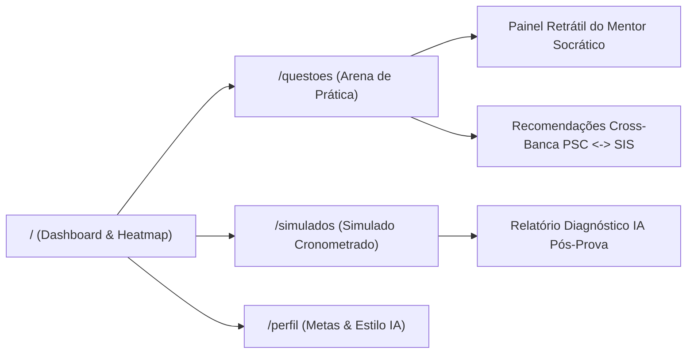

# Design System & Arquitetura Frontend — Ecossistema LG2M

**Projeto:** LG2M — Ecossistema Agêntico de Estudos Seriado (PSC/UFAM & SIS/UEA)  
**Hackathon:** AKCIT Camp 2026  
**Stack Frontend:** Next.js 14 (App Router), TypeScript 5.6, Tailwind CSS 3.4, KaTeX 0.16, Lucide React  
**Diretório:** `lg2m/frontend/`  

---

## 1. Princípios de Design & Ergonomia Pedagógica

1. **Foco Cognitivo Sem Distrações:** O vestibulando do PSC/SIS precisa de imersão total. Adotamos um tema escuro de alto contraste (`slate-950` / `slate-900`) com acentos em cores funcionais:
   - **Azul Royal (`#2563eb`):** Identidade institucional do PSC (UFAM) e links navegacionais.
   - **Verde Esmeralda (`#10b981`):** Identidade do SIS (UEA), indicações de acerto e progresso de domínio.
   - **Âmbar / Coral (`#f59e0b` / `#ef4444`):** Alertas de **Pontos Cegos** e erros conceituais críticos.
2. **Blindagem Rigorosa de Gabaritos:** A interface nunca recebe o gabarito oficial até que o estudante clique em "Confirmar Resposta" ou finalize o simulado. O backend FastAPI atua como *Ground Truth Pinning*.
3. **Renderização Matemática Fiel com KaTeX:** Fórmulas físicas e químicas (ex: $F = m \cdot a$, $\Delta H$, matrizes e integrais) são processadas pelo componente customizado `MathRenderer`, garantindo legibilidade perfeita mesmo em dispositivos móveis.

---

## 2. Mapa de Rotas e Telas do MVP

### 2.1. Tela 1: Onboarding, Perfil & Metas (`/perfil`)
- Permite ao estudante alternar o certame alvo prioritário (PSC vs SIS).
- Configuração do **Estilo Didático do Mentor IA**:
  - *Direto & Objetivo:* Explica a pegadinha e o gabarito de imediato.
  - *Socrático (Guiado):* Faz perguntas de reflexão para estimular a dedução autônoma.
  - *Teórico Formal:* Fundamenta com axiomas, leis físicas e rigor matemático.
- Mapeamento do curso pretendido e tempo diário disponível.

### 2.2. Tela 2: Dashboard & Heatmap Cognitivo (`/`)
- **KPIs em Tempo Real:** Taxa de acerto acumulada, total de resoluções, total de pontos cegos críticos e tempo médio por questão.
- **Painel de Ação Imediata (Pontos Cegos):** Destaca tópicos em estado de alerta (< 50% de domínio) com CTA direto para prática.
- **Heatmap de Domínio Curricular:** Visualizador com código de cores verde/âmbar/vermelho por assunto e disciplina.

### 2.3. Tela 3 & 4: Arena de Prática & Mentor Socrático (`/questoes`)
- Barra de busca semântica em linguagem natural e filtros por Banca (PSC/SIS), Etapa (1, 2, 3) e Disciplina.
- Exibição de texto-base retrátil, enunciado matemático e alternativas interativas.
- Botão "Confirmar Resposta" que revela o gabarito oficial e feedback imediato.
- **Drawer Retrátil do Mentor IA:** Chat interativo com streaming, permitindo tirar dúvidas conceituais sem sair da questão.
- **Flywheel Cross-Banca:** Sugestão de itens idênticos em raciocínio da outra banca (ex: se fez PSC, recomenda item análogo do SIS).

### 2.4. Tela 5 & 6: Simulados Oficiais & Diagnóstico Pós-Prova (`/simulados`)
- **Configurador:** Criação de prova geral ou temática com quantidade calibrável (5 a 30 questões).
- **Ambiente de Prova:** Cronômetro regressivo em tempo real, grade de questões (pills de 1 a N) com marcação visual de status.
- **Relatório Diagnóstico Pós-Prova:** Parecer analítico pedagógico emitido pelo Agente Profiler, aproveitamento percentual geral, desdobramento por disciplina e gabarito detalhado.
