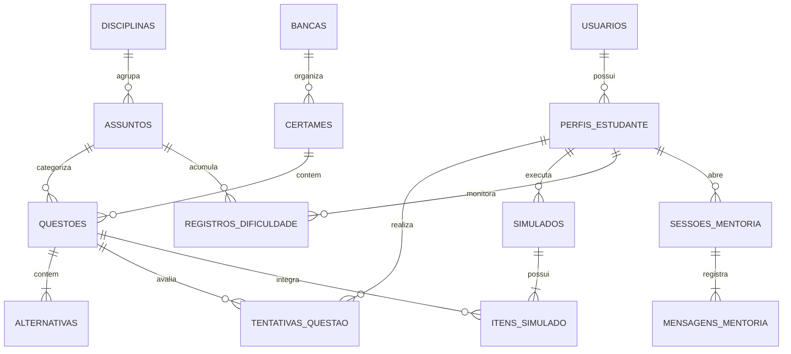

# Modelo de Banco de Dados Relacional e Vetorial — LG2M

> **Módulo:** Infraestrutura & Persistência  
> **Status:** Implementado e Populado  
> **Versão:** 1.0  
> **Data:** 24/09/2026  
> **Implementação ORM:** `lg2m/backend/app/models/entities.py`

---

## 1. Diagrama Entidade-Relacionamento (ERD)

---

## 2. Dicionário de Tabelas e Atributos

### 2.1. Tabelas Centrais de Conteúdo e Exames
* **`bancas`:** Cadastro das bancas examinadoras (`id`, `nome`, `sigla`, `descricao`).
* **`certames`:** Certames organizados por banca (`id`, `banca_id`, `nome`, `sigla`, `instituicao`, `tipo_certame`, `esfera`).
* **`disciplinas`:** Matérias do currículo (`id`, `nome`, `area_conhecimento`).
* **`assuntos`:** Tópicos curriculares específicos (`id`, `disciplina_id`, `nome`).
* **`questoes`:** Tabela mestra de questões (`id`, `codigo_referencia`, `certame_id`, `assunto_id`, `ano`, `etapa_edicao`, `numero_questao`, `disciplina_nome`, `area_conhecimento`, `topico_especifico`, `texto_base`, `enunciado`, `gabarito_oficial`, `tem_imagem`, `imagens`, `possui_formula_matematica`, `tags`, `embedding_json`).
* **`alternativas`:** Opções de múltipla escolha A a E (`id`, `questao_id`, `letra`, `texto`, `eh_correta`, `tipo_pegadinha`, `explicacao_distrator`).

### 2.2. Tabelas do Estudante, Cognição e Mentoria
* **`usuarios`:** Dados de autenticação e plano (`id`, `email`, `nome`, `senha_hash`, `tipo_plano`, `created_at`).
* **`perfis_estudante`:** Perfil ativo e estilo didático (`id`, `usuario_id`, `certame_foco`, `estilo_didatico_padrao`).
* **`tentativas_questao`:** Registro detalhado de cada resposta submetida (`id`, `perfil_id`, `questao_id`, `alternativa_marcada`, `acertou`, `tempo_gasto_segundos`, `causa_erro`, `created_at`).
* **`registros_dificuldade`:** Base do Mapa de Calor cognitivo (`id`, `perfil_id`, `assunto_id`, `total_tentativas`, `total_erros`, `indice_dominio`, `updated_at`).
* **`simulados` & `itens_simulado`:** Sessões de simulados e cadernos de exercícios (`id`, `perfil_id`, `certame_sigla`, `etapa`, `tipo`, `total_questoes`, `total_acertos`, `status`).
* **`sessoes_mentoria` & `mensagens_mentoria`:** Histórico de chat da mentoria com o agente (`id`, `sessao_id`, `remetente`, `conteudo`, `tipo_agente`, `created_at`).
