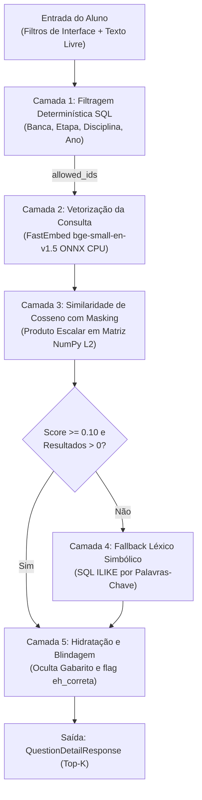
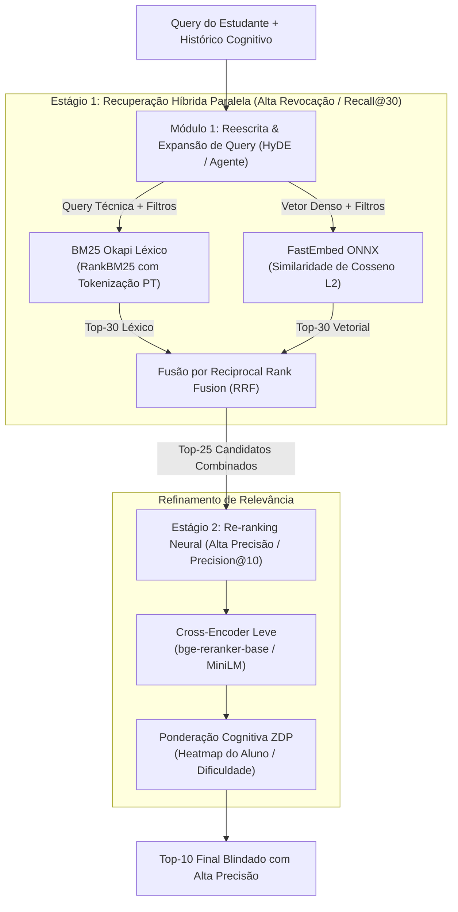
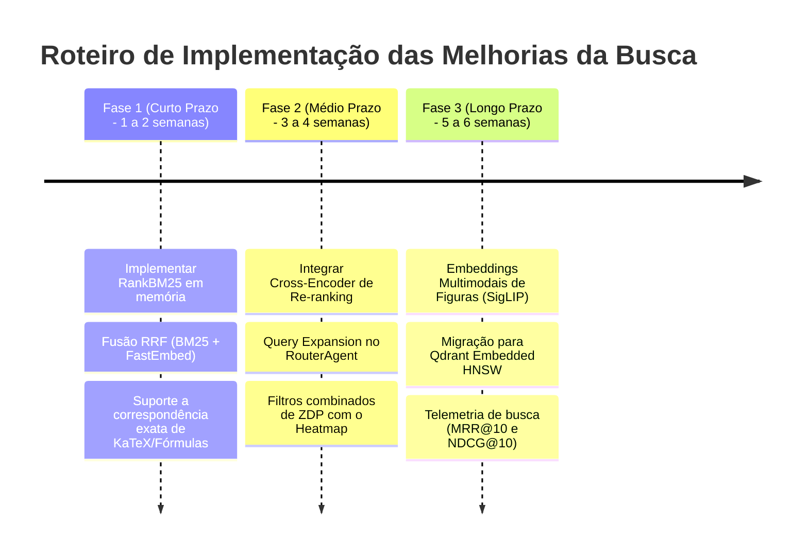

# Proposta de Engenharia: Evolução do Motor de Busca de Questões — LG2M

> **Módulo:** Core Backend & Information Retrieval (IR)  
> **Status:** Proposta Técnica & Especificação de Arquitetura  
> **Data:** 25/09/2026  
> **Autores:** Agente Antigravity / Time de Engenharia LG2M  
> **Contexto:** Plataforma de Preparação Seriada (PSC/UFAM & SIS/UEA)

---

## 1. Sumário Executivo

A área de questões da plataforma **LG2M** conta com um acervo de **6.158 itens canônicos certificados** (2002 a 2025). Atualmente, a busca opera em uma arquitetura híbrida de duas etapas (Filtro SQL Relacional + Similaridade de Cosseno via FastEmbed ONNX em memória).

Embora a solução atual apresente baixíssima latência (tempo sub-milissegundo em CPU) e excelente compreensão conceitual devido ao *Document Expansion* prévio, ela possui limitações intrínsecas a sistemas baseados exclusivamente em *Bi-Encoders* densos: perda de correspondência em termos literais exatos (fórmulas químicas, leis, nomes próprios), incapacidade de interpretar buscas vagas de estudantes e descolamento do perfil cognitivo do usuário.

Este documento formaliza o diagnóstico da arquitetura vigente e propõe uma **Arquitetura de Busca Híbrida 2.0 (Two-Stage Hybrid Search com RRF, Cross-Encoder e Personalização Cognitiva ZDP)**.

---

## 2. Diagnóstico da Arquitetura Atual

### 2.1. O Pipeline Vigente em 5 Camadas

1. **Camada 0 (Offline — Document Expansion):**  
   Cada questão foi previamente enriquecida com o campo `descricao_detalhada`, gerando o bloco:  
   $$\text{Bloco Semântico} = [\text{Disciplina}] + [\text{Assunto}] + \text{Tópico} + \text{Descrição Detalhada} + \text{Enunciado}$$
   Esse bloco foi indexado em matriz binária `vector_index.npz` (384 dimensões normalizadas, $8.17\text{ MB}$).
2. **Camada 1 (Hard Filtering SQL):**  
   Filtros categóricos rígidos (`PSC`, `SIS`, `Etapa`, `Disciplina`, `Ano`) restringem o universo de busca a um conjunto de `allowed_ids`.
3. **Camada 2 (Dense Query Embedding):**  
   A query é codificada em vetor unitário $\vec{q} \in \mathbb{R}^{384}$ em $\approx 1.5\text{ ms}$.
4. **Camada 3 (Cosine Scoring & Masking):**  
   Cálculo matricial de produto escalar $\mathbf{E} \cdot \vec{q}$, aplicando máscara booleana nos índices fora de `allowed_ids`.
5. **Camada 4 (Fallback Léxico):**  
   Se o índice vetorial estiver inacessível ou não retornar itens acima do limiar, aciona `ILIKE` em SQL.
6. **Camada 5 (Blindagem e Hidratação):**  
   Garante segurança pedagógica: remove `gabarito_oficial` e `eh_correta` do retorno da API.

---

### 2.2. Gargalos e Oportunidades de Melhoria

| Dimensão | Comportamento Atual | Gargalo / Limitação | Impacto no Usuário |
| :--- | :--- | :--- | :--- |
| **Casamento Léxico Exato** | O fallback léxico só roda se o vetor falhar. | Termos técnicos como `C2H4O2`, `Le Chatelier`, `art. 5º` ou `Lei 11.516` perdem para termos semanticamente correlatos mas sem a palavra exata. | Estudante busca por fórmula ou lei específica e recebe itens genéricos do assunto. |
| **Poder de Discriminação** | Bi-Encoder gera embeddings independentes de query e questão. | Dificuldade em capturar nuances de negação sintática (ex: *"que NÃO seja função sobrejetora"* vs *"função sobrejetora"*). | Retorno de itens que pedem a afirmação contrária à desejada. |
| **Compreensão de Buscas Vagas** | A query é vetorizada literalmente. | Buscas informais de estudantes (ex: *"aquela questão do ovo que quase só tem gema"*) não atingem termos técnicos do acervo (*"ovo telolécito"*). | Baixa taxa de recuperação (Zero-Hit) em linguagem coloquial. |
| **Contextualização do Estudante** | A busca é idêntica para qualquer aluno. | Não considera se o aluno domina ou não o assunto, nem o nível de proficiência aferido no Heatmap. | Aluno iniciante é confrontado com itens de aprofundamento extremo e se desmotiva. |
| **Suporte Multimodal** | Apenas representação textual do enunciado e KaTeX. | ~20% das questões do PSC/SIS dependem de gráficos, mapas, tirinhas ou circuitos elétricos. | Impossibilidade de buscar por diagramas ou itens visualmente análogos. |

---

## 3. Especificação da Arquitetura Proposta: Busca Híbrida 2.0

Para solucionar esses gargalos, propõe-se um **motor de recuperação em dois estágios (Two-Stage Retrieval)** com fusão por RRF e re-ranking neural.

---

### 3.1. Melhoria A: Fusão Híbrida Real via Reciprocal Rank Fusion (RRF)

Em vez de usar a busca léxica apenas como plano de contingência, executa-se o **BM25 Okapi** e a **Busca Vetorial Densa** em paralelo para toda requisição.

A combinação das listas ranqueadas dispensa a normalização complexa de scores heterogêneos utilizando a fórmula RRF:
$$\text{Score}_{\text{RRF}}(d) = \sum_{m \in \{\text{BM25}, \text{Dense}\}} \frac{1}{k + r_m(d)}$$
Onde:
* $r_m(d)$ é a posição ordinal do documento $d$ no ranking do modelo $m$ (1-indexed).
* $k$ é a constante de suavização padrão ($k = 60$).

**Vantagem Direta:** Se uma questão contiver o termo literal exato (ex: `Lei 11.516`), o BM25 a posicionará nas primeiras posições; se contiver o conceito semântico (ex: *"órgão gestor de unidades de conservação"*), o FastEmbed a puxará para cima. A interseção de ambos terá pontuação dominante.

---

### 3.2. Melhoria B: Two-Stage Retrieval com Re-ranking por Cross-Encoder

Modelos Bi-Encoder projetam query e documento separadamente em um espaço vetorial comum. Já os **Cross-Encoders** recebem o par concatenado `[CLS] Query [SEP] Questão [SEP]` e realizam atenção cruzada (Full Cross-Attention) em todas as camadas do Transformer:

1. **Estágio 1 (Recuperação):** O RRF seleciona os **Top-25 candidatos** em $< 10\text{ ms}$.
2. **Estágio 2 (Re-ranking):** Um Cross-Encoder quantizado em ONNX (ex.: `BAAI/bge-reranker-base` ou `ms-marco-MiniLM-L-6-v2`) recalcula o score de relevância dos 25 itens em lote:
   $$\text{Score}_{\text{final}}(d) = \sigma(\text{CrossEncoder}(\text{query}, \text{questao}_d))$$
3. O Top-10 final passa a ter uma acurácia de alinhamento sintático e conceitual significativamente superior.

---

### 3.3. Melhoria C: Reescrita e Expansão Agêntica de Consulta (Query Expansion / HyDE)

Quando o estudante submete termos ambíguos ou descrições informais, o nó `router_agent` pré-processa a requisição:

1. **Identificação de Entidades Curriculares:** Reconhece jargões populares e mapeia para a taxonomia oficial do PSC/SIS:
   * Entrada: *"questão daquela fórmula de dilatação com água que congela por cima"*
   * Consulta expandida: *"comportamento anômalo da água, dilatação térmica, ponto de densidade máxima a 4 graus Celsius, congelamento superficial de rios"*
2. **HyDE (Hypothetical Document Embeddings):** Para consultas conceituais complexas, o agente gera um mini-enunciado plausível e gera o embedding sobre esse documento ideal, buscando itens canônicos com similaridade topológica.

---

### 3.4. Melhoria D: Busca Personalizada por Perfil Cognitivo (ZDP)

A busca na área de questões não deve ser estática, mas adaptativa à jornada do estudante:

1. O endpoint de busca recebe o `perfil_id` da sessão autenticada.
2. Consulta o `RegistroDificuldade` do aluno para os assuntos das questões candidatas.
3. **Ponderação por Zona de Desenvolvimento Proximal (ZDP):**
   * Se o aluno possui **domínio $< 40\%$** no assunto (Ponto Cego Crítico): o ranking prioriza questões com grau de dificuldade `FACIL` e `MEDIO` para sedimentação de base.
   * Se o aluno possui **domínio $\ge 75\%$**: o ranking prioriza questões `DIFICIL` ou com armadilhas frequentes de banca para treino de alta performance.
   $$\mathrm{Score}_{\mathrm{personalizado}} = 0.75 \times \mathrm{Score}_{\mathrm{CrossEncoder}} + 0.25 \times \mathrm{Score}_{\mathrm{ZDP}}(d, \mathrm{aluno})$$

---

### 3.5. Melhoria E: Indexação Multimodal para Figuras e Gráficos (OpenCLIP)

No PSC e SIS, muitas questões de Física (óptica e circuitos), Biologia (citologia e teias ecológicas) e Matemática (geometria espacial) trazem enunciados curtos cuja informação essencial reside na imagem.

1. Extração dos *crops* de imagens já mapeados no campo `imagens: [{arquivo, bbox, ...}]`.
2. Geração de embeddings visuais utilizando modelo leve **SigLIP / OpenCLIP**.
3. Criação de índice vetorial multimodal `image_index.npz` permitindo:
   * **Busca por Imagem:** O aluno faz upload de foto ou captura de tela de uma questão e o sistema localiza a questão idêntica ou equivalente na base canônica;
   * **Similaridade Gráfica:** Identificar questões que compartilham o mesmo tipo de diagrama ou representação geométrica.

---

### 3.6. Melhoria F: Vector Store Embarcado para Alta Concorrência (Qdrant Embedded / FAISS)

Atualmente, o vetor reside em matriz NumPy `np.load` com `np.dot`. Esta arquitetura é ideal para o MVP (zero dependências externas e execução rápida em CPU). Contudo, para suportar múltiplos usuários simultâneos e expansão do acervo:

* Adotar **Qdrant Embedded** (`qdrant-client` em modo local ou SQLite/RocksDB local) ou **FAISS com índice HNSW** (*Hierarchical Navigable Small World*):
  * Suporta filtros de metadados nativos com payload sem necessidade de carregar `allowed_ids` prévios via SQL;
  * Consumo de memória reduzido com quantização escalar (SQ8);
  * Complexidade de busca logarítmica $\mathcal{O}(\log N)$.

---

## 4. Plano de Implementação em Fases

---

## 5. Métricas de Avaliação Recomendadas

Para validar quantitativamente o ganho com as novas camadas de busca:

1. **MRR@10 (Mean Reciprocal Rank):** Avaliar a posição média do primeiro resultado relevante em um conjunto de 100 queries de teste calibradas contra o edital.
2. **NDCG@10 (Normalized Discounted Cumulative Gain):** Avaliar a graduação de relevância do Top-10 retornado.
3. **Latência p95:** Manter a resposta da busca abaixo de $25\text{ ms}$ em ambiente de produção CPU.
4. **Taxa de Zero-Hits:** Reduzir a zero as buscas de termos válidos que não retornam resultados.
