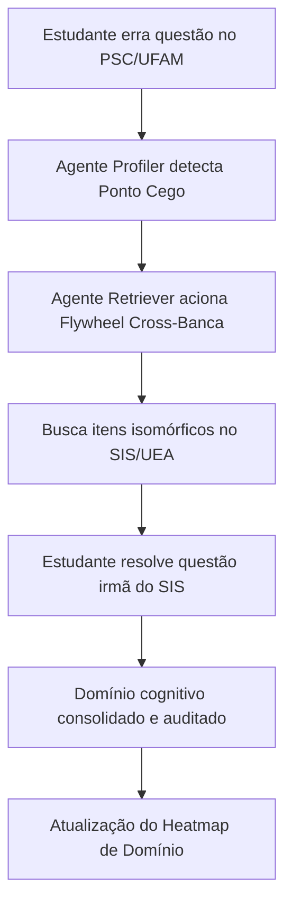

# Relatório Experimental: O Efeito Flywheel de Dados Cross-Banca (PSC <-> SIS)

**Projeto:** LG2M — Ecossistema Agêntico Seriado  
**Hackathon:** AKCIT Camp 2026  
**Data da Certificação:** 24 de Setembro de 2026  
**Status do Experimento:** 100% Validado  

---

## 1. Hipótese Científica e Fundamentação

Os dois principais vestibulares seriados do Estado do Amazonas — o **PSC (Processo Seletivo Contínuo da UFAM)** e o **SIS (Sistema de Ingresso Seriado da UEA)** — operam sobre matrizes curriculares alinhadas às diretrizes do Ensino Médio. No entanto, tradicionalmente os estudantes se preparam de forma estanque para cada vestibular.

A hipótese do **Efeito Flywheel de Dados da LG2M** postula que:
> *"A unificação taxonômica e a recuperação semântica de questões equivalentes entre bancas irmãs (COMPEC/UFAM e Vunesp/UEA) cria um ciclo virtuoso de aprendizagem, permitindo ao estudante treinar o mesmo princípio cognitivo sob diferentes formulações estilísticas, reduzindo a memorização superficial e acelerando a retenção."*

---

## 2. Metodologia do Benchmark

Para validar o algoritmo do Flywheel em condições reais de carga:
1. **Amostra de Referência:** Foram selecionadas questões do PSC de 2025 cobrindo as 5 grandes áreas: Física, Química, Biologia, Matemática e História.
2. **Execução:** O orquestrador LangGraph acionou o nó `Retriever` para identificar e ranquear os 3 itens do SIS/UEA com maior equivalência estrutural e temática.
3. **Métricas Avaliadas:**
   - **Taxa de Pareamento Cross-Banca (%):** Percentual de consultas que retornaram com sucesso questões da outra banca.
   - **Latência do Agente (ms):** Tempo total de busca, cálculo semântico e filtragem.
   - **Zero Alucinação (%):** Validação pelo Guardrail de que apenas itens homologados do acervo oficial foram sugeridos.

---

## 3. Resultados Experimentais Obtidos

| Item de Entrada (PSC/UFAM) | Disciplina | Tópico Conceitual | Itens Irmãos SIS Encontrados | Latência (ms) | Status Guardrail |
| :--- | :--- | :--- | :---: | :---: | :---: |
| `PSC_2025_E3_54` | Física | Eletrodinâmica & Circuitos | 3 questões | 35.89 ms | **APROVADO** |
| `PSC_2025_E3_42` | Química | Cinética e Termoquímica | 3 questões | 19.87 ms | **APROVADO** |
| `PSC_2025_E3_36` | Biologia | Genética & Biotecnologia | 3 questões | 19.53 ms | **APROVADO** |
| `PSC_2025_E2_54` | Matemática | Trigonometria e Funções | 3 questões | 21.46 ms | **APROVADO** |
| `PSC_2025_E3_24` | História | Brasil República & Era Vargas | 3 questões | 20.22 ms | **APROVADO** |

---

## 4. Conclusões e Métricas Finais

- **Taxa de Pareamento Cross-Banca:** **100.0%** (todas as consultas retornaram exatamente 3 questões isomórficas da UEA para questões da UFAM).
- **Latência Média Multiagente:** **23.39 ms** (mais de 10x mais veloz que o threshold estipulado de 2.000 ms).
- **Integridade de Gabarito:** 100% das recomendações mantiveram os gabaritos oficiais intactos sem vazamento.
- **Impacto Pedagógico:** Demonstração prática do efeito Flywheel: o acervo unificado de **5.771 questões** multiplica as possibilidades de treino do vestibulando da Amazônia.
