# Roteiro Cronometrado de Pitch e Demonstração — Hackathon AKCIT Camp 2026

**Projeto:** LG2M — Ecossistema Agêntico de Estudos Seriado (PSC/UFAM & SIS/UEA)  
**Tempo Total de Apresentação:** 3 minutos (180 segundos)  
**Objetivo:** Demonstrar aos avaliadores o rigor técnico, o ineditismo pedagógico e a experiência fluida do MVP funcional.  

---

## ⏱️ Linha do Tempo da Apresentação (3 Minutos)

```mermaid
gantt
    title Estrutura da Apresentação de 3 Minutos
    dateFormat  s
    axisFormat %S s
    section Pitch
    O Problema do Vestibular Seriado :0, 45
    A Solução LG2M & Multiagente     :45, 105
    Live Demo do MVP Funcional       :105, 150
    Impacto & Visão de Futuro        :150, 180
```

---

### [00:00 - 00:45] O Problema Real: O Isolamento dos Vestibulandos no Amazonas

> **Fala do Apresentador:**
> *"Todos os anos, dezenas de milhares de jovens no Amazonas disputam vagas na UFAM e na UEA pelo Processo Seletivo Contínuo (PSC) e pelo SIS. Diferente do ENEM, esses vestibulares cobram conteúdos seriados ano a ano. 
> Mas o que o vestibulando encontra hoje para estudar? PDFs dispersos, escaneados, gabaritos que mudam após recursos e plataformas nacionais genéricas que ignoram a realidade curricular regional. 
> O resultado? O aluno estuda às cegas, sem saber onde estão seus pontos cegos conceituais e sem apoio pedagógico personalizado."*

---

### [00:45 - 01:45] A Solução LG2M & Inovação Tecnológica Multiagente

> **Fala do Apresentador:**
> *"Para mudar essa realidade, construímos a **LG2M**: o primeiro ecossistema agêntico de estudos com foco piloto no PSC/UFAM e SIS/UEA.
> Fizemos a engenharia reversa e extração rigorosa de **5.771 questões históricas oficiais** dos últimos 20 anos, todas com gabaritos homologados e matriz taxonômica BNCC.
> 
> Por trás da interface, opera uma **arquitetura de 5 agentes autônomos orquestrados no LangGraph**:
> 1. O **Router**, que faz a triagem cognitiva da dúvida;
> 2. O **Curador RAG Semântico**, que opera o Efeito Flywheel conectando questões equivalentes da UFAM e da UEA;
> 3. O **Mentor Didático**, capaz de ensinar em 3 estilos: Direto, Teórico e Socrático;
> 4. O **Guardrail com Ground Truth Pinning**, que garante **zero alucinação** e blindagem do gabarito até a submissão;
> 5. E o **Profiler Cognitivo**, que atualiza em tempo real o Heatmap de Domínio do aluno."*

---

### [01:45 - 02:30] Live Demo do MVP (Navegação ao Vivo)

> **Roteiro Visual na Tela:**
> 1. **[01:45 - 02:00] Dashboard Principal (`/`):**
>    - Mostrar o **Heatmap Cognitivo** com visualização por código de cores (verde, amarelo e vermelho).
>    - Destacar o painel **Alerta de Pontos Cegos**: *"Vejam como a IA já identificou que o estudante está com 25% de domínio em Dinâmica/Leis de Newton."*
> 
> 2. **[02:00 - 02:15] Arena de Prática & Resolução Blindada (`/questoes`):**
>    - Fazer uma busca semântica livre: *"Newton rampa plano inclinado"*.
>    - Mostrar a renderização impecável das fórmulas KaTeX.
>    - Marcar uma alternativa e clicar em **Confirmar Resposta**: *"O gabarito oficial só é revelado agora, garantindo a lisura do treino."*
> 
> 3. **[02:15 - 02:30] Mentor Socrático & Flywheel Cross-Banca:**
>    - Abrir o chat do **Mentor Didático**: mostrar a IA fazendo perguntas instigantes para conduzir o raciocínio sem entregar a resposta de bandeja.
>    - Mostrar o bloco **Flywheel Cross-Banca**: *"E aqui a magia acontece: o sistema já sugere automaticamente uma questão irmã da UEA sobre o mesmo princípio físico."*

---

### [02:30 - 03:00] Impacto Regional, Métricas e Encerramento

> **Fala do Apresentador:**
> *"Nosso benchmark experimental comprovou **100% de taxa de pareamento cross-banca** com **latência média de apenas 23 milissegundos**.
> Mais do que uma plataforma de questões, a LG2M democratiza a mentoria de elite para qualquer estudante de escola pública do interior do Amazonas ou da capital.
> Temos um dataset certificado de 5.771 itens, uma arquitetura modular em FastAPI, LangGraph e Next.js 14, pronta para escalar para todo o Brasil.
> Muito obrigado!"*

---

## 🎯 Dicas de Ouro para a Apresentação
- **Confiança e Ritmo:** Pratique as falas mantendo tom enérgico e seguro.
- **Deixe as abas do navegador pré-carregadas:**
  - Aba 1: `http://localhost:3000` (Dashboard com Heatmap populado).
  - Aba 2: `http://localhost:3000/questoes` (Arena de Prática).
  - Aba 3: `http://localhost:3000/simulados` (Simulado ou resultado).
  - Aba 4: `http://localhost:8000/docs` (Swagger da API para exibir aos jurados técnicos).
